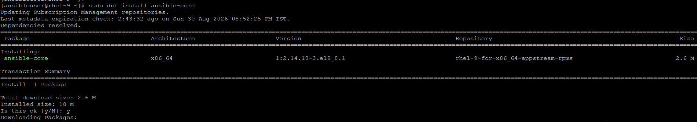
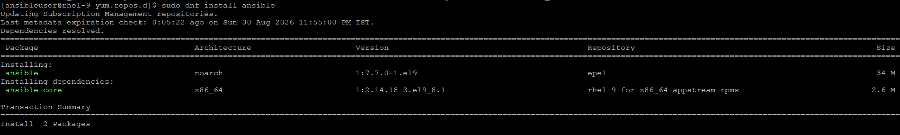
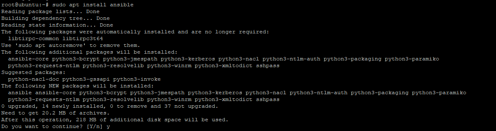
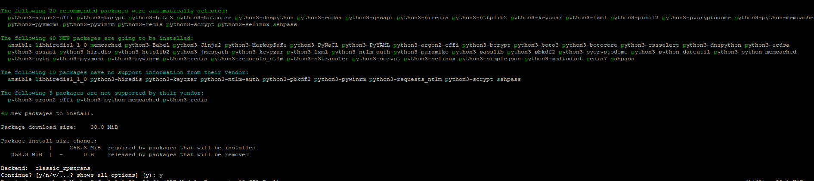
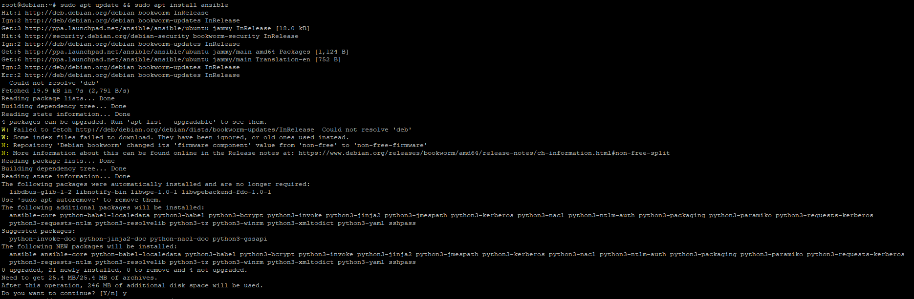
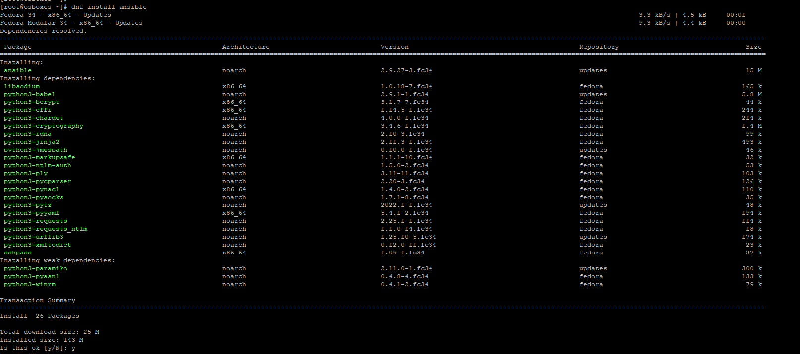
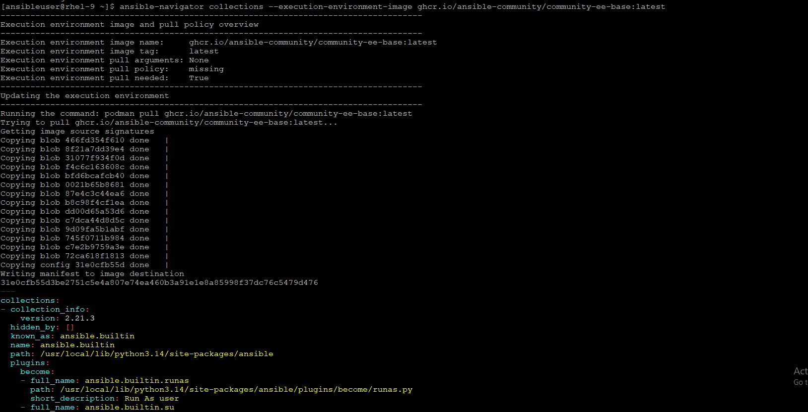
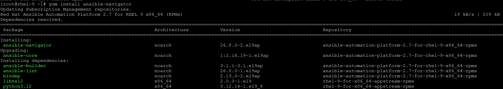

# Installing Ansible
Ansible is an agentless automation tool that you install on a single host (referred to as the control node).

## Control Node Requirements
The control node executes the playbooks. It does not run a daemon or require a database, it runs purely as a CLI tool.
- Operating System: Nearly any POSIX/UNIX-like system is supported. This includes Red Hat Enterprise Linux, Debian, Ubuntu, macOS, and BSDs.
- Python Interpreter: The control node must have an updated version of Python 3 installed. The required version depends directly on your ansible-core release:
    
        ansible-core 2.18: Requires Python 3.11 to 3.13
        ansible-core 2.17: Requires Python 3.10 to 3.12
        ansible-core 2.16: Requires Python 3.10 to 3.12
- Hardware: Minimal overhead. A baseline machine or VM with 1 CPU, 512MB to 1GB of RAM, and enough disk space for your project files is fully sufficient.

## Managed node requirements
Ansible is agentless, meaning you do not need to install ansible-core or any special background software on the target systems.
- Connection Protocol: The managed node must have an SSH daemon running. You must be able to log in using an account that opens an interactive POSIX-compliant shell.
- Python Interpreter: The managed node requires Python to execute the modules sent over by the control node.
    
    ansible-core 2.18+: Requires Python 3.8 to 3.13 on the target system (Python 3.7 support has been deprecated).
- Network Exception: Network devices (like Cisco switches or Arista routers) do not require Python installed on the device itself; the modules execute locally on the control node.
- Windows Targets: For managing Windows targets, Python is not required on the client machine; instead, Ansible utilizes PowerShell over WinRM or SSH.


## Selecting an Ansible package and version to install

### Install ansible-core on REDHAT LINUX
- If server image is built or downloaded from console.redhat.com and registered to CDN network then we do have ansible-core installed at part of RHEL subscription with system (but we have limited support)
- Server should be registered to some upstream network, In this LAB, our server is registered to [console.redhat.com](https://console.redhat.com/) and using `Red Hat Developer Subscription for Individuals Subscription`
- If you have not any developer account yet, then create one [here](https://developers.redhat.com/)
- Need help to register the server to developers subscriptions, [check here](https://youtu.be/_x4L54yIXgA?si=68yYLbvQ64DmA83-)
    ```
    (mostly it is attached to this Developer pools if not then run:)
    # subscription-manager attach --auto
    OR 
    # subscription-manager list --available
    # subscription-manager attach --pool=<POOL_ID>
    
    check the repositories:
    # dnf repolist all
    
    (if appstream-rpms repo is not enabled then we can enable as:)
    # subscription-manager repos --enable=rhel-9-for-x86_64-appstream-rpms
    # dnf install ansible-core
    ```
    

### Install Community Ansible from EPEL
- Configure the [EPEL Repo](https://docs.fedoraproject.org/en-US/epel/#_quickstart) (EPEL 9 Everything x86_64)
- [Setting up EPEL](https://docs.fedoraproject.org/en-US/epel/getting-started/)
    ```
    # subscription-manager repos --enable codeready-builder-for-rhel-9-$(arch)-rpms
    # dnf install https://dl.fedoraproject.org/pub/epel/epel-release-latest-9.noarch.rpm
    # dnf repolist
    Updating Subscription Management repositories.
    repo id                                                                          repo name
    codeready-builder-for-rhel-9-x86_64-rpms                                         Red Hat CodeReady Linux Builder for RHEL 9 x86_64 (RPMs)
    epel                                                                             Extra Packages for Enterprise Linux 9 - x86_64
    epel-cisco-openh264                                                              Extra Packages for Enterprise Linux 9 openh264 (From Cisco) - x86_64
    rhel-9-for-x86_64-appstream-rpms                                                 Red Hat Enterprise Linux 9 for x86_64 - AppStream (RPMs)
    rhel-9-for-x86_64-baseos-rpms                                                    Red Hat Enterprise Linux 9 for x86_64 - BaseOS (RPMs)

    # ansible --version
    ansible [core 2.14.18]
        config file = /home/ansibleuser/.ansible.cfg
        configured module search path = ['/home/ansibleuser/.ansible/plugins/modules', '/usr/share/ansible/plugins/modules']
        ansible python module location = /usr/lib/python3.9/site-packages/ansible
        ansible collection location = /home/ansibleuser/.ansible/collections:/usr/share/ansible/collections
        executable location = /usr/bin/ansible
        python version = 3.9.25 (main, Jul 13 2026, 00:00:00) [GCC 11.5.0 20240719 (Red Hat 11.5.0-14)] (/usr/bin/python3)
        jinja version = 3.1.2
        libyaml = True

    ```
    

### Install ansible on Ubuntu
- Ubuntu provides Ansible packages through a [Personal Package Archive (PPA)](https://launchpad.net/~ansible/+archive/ubuntu/ansible) that contains more recent versions than the standard repositories.
    ```
    # sudo apt update
    # sudo apt install software-properties-common
    # sudo add-apt-repository --yes --update ppa:ansible/ansible
    # sudo apt install ansible
    # root@ubuntu:~# ansible --version
    ansible [core 2.21.3]
        config file = /etc/ansible/ansible.cfg
        configured module search path = ['/root/.ansible/plugins/modules', '/usr/share/ansible/plugins/modules']
        ansible python module location = /usr/lib/python3/dist-packages/ansible
        ansible collection location = /root/.ansible/collections:/usr/share/ansible/collections
        executable location = /usr/bin/ansible
        python version = 3.12.3 (main, Jun 19 2026, 12:46:00) [GCC 13.3.0] (/usr/bin/python3)
        jinja version = 3.1.2
        pyyaml version = 6.0.1 (with libyaml v0.2.5)
    ```
    

### Install ansible on suse
- OpenSUSE provides Ansible packages through the standard package manager.
- Install supoort, [check here](https://en.opensuse.org/Portal:Support)
    ```
    # zypper install ansible

    # ansible --version
    ansible 2.9.27
        config file = /etc/ansible/ansible.cfg
        configured module search path = ['/root/.ansible/plugins/modules', '/usr/share/ansible/plugins/modules']
        ansible python module location = /usr/lib/python3.6/site-packages/ansible
        executable location = /usr/bin/ansible
        python version = 3.6.15 (default, Sep 23 2021, 15:41:43) [GCC]
    ```
    

### Install Ansible on debian
- Debian users can choose between the standard repository or the Ubuntu PPA for more recent versions.
    ```
    # UBUNTU_CODENAME=jammy
    # wget -O- "https://keyserver.ubuntu.com/pks/lookup?fingerprint=on&op=get&search=0x6125E2A8C77F2818FB7BD15B93C4A3FD7BB9C367" | sudo gpg --dearmor -o /usr/share/keyrings/ansible-archive-keyring.gpg
    # echo "deb [signed-by=/usr/share/keyrings/ansible-archive-keyring.gpg] http://ppa.launchpad.net/ansible/ansible/ubuntu $UBUNTU_CODENAME main" | sudo tee /etc/apt/sources.list.d/ansible.list
    # sudo apt update && sudo apt install ansible
    
    # ansible --version
    ansible [core 2.17.14]
        config file = /etc/ansible/ansible.cfg
        configured module search path = ['/root/.ansible/plugins/modules', '/usr/share/ansible/plugins/modules']
        ansible python module location = /usr/lib/python3/dist-packages/ansible
        ansible collection location = /root/.ansible/collections:/usr/share/ansible/collections
        executable location = /usr/bin/ansible
        python version = 3.11.2 (main, May 12 2026, 05:17:27) [GCC 12.2.0] (/usr/bin/python3)
        jinja version = 3.1.2
        libyaml = True
    ```
    

### Install Ansible on Fedora
- Fedora Linux provides both the full Ansible package and the minimal ansible-core package through the standard repositories.
    ```
    Install the full ansible package:
    # dnf install ansible
    # ansible --version
    ansible 2.9.27
        config file = /etc/ansible/ansible.cfg
        configured module search path = ['/root/.ansible/plugins/modules', '/usr/share/ansible/plugins/modules']
        ansible python module location = /usr/lib/python3.9/site-packages/ansible
        executable location = /usr/bin/ansible
        python version = 3.9.13 (main, May 18 2022, 00:00:00) [GCC 11.3.1 20220421 (Red Hat 11.3.1-2)]

    Install the minimal ansible-core package:
    # dnf install ansible-core
    # ansible --version
    ansible [core 2.12.6]
        config file = /etc/ansible/ansible.cfg
        configured module search path = ['/root/.ansible/plugins/modules', '/usr/share/ansible/plugins/modules']
        ansible python module location = /usr/lib/python3.9/site-packages/ansible
        ansible collection location = /root/.ansible/collections:/usr/share/ansible/collections
        executable location = /usr/bin/ansible
        python version = 3.9.13 (main, May 18 2022, 00:00:00) [GCC 11.3.1 20220421 (Red Hat 11.3.1-2)]
        jinja version = 2.11.3
        libyaml = True

    
    Fedora repositories include several Ansible collections as standalone packages
    # dnf install ansible-collection-community-general
    # ansible-galaxy collection list
    # /usr/share/ansible/collections/ansible_collections
    Collection        Version
    ----------------- -------
    community.general 3.8.7
    ```
- Checkout the list of [Ansible collections packages](https://packages.fedoraproject.org/search?query=ansible-collection) in Fedora.
    


### Install Ansible with Python pip
- pip will install the very latest version of Ansible from distribution repositories and you might find the additional feature of ansible which does not get stablized and need more testing.
    ```
    Ensuring pip is available
    # python3 -m pip -V
    pip 21.3.1 from /usr/lib/python3.9/site-packages/pip (python 3.9)

    If no pip installed then on Fedora/CentOS/Redhat, we can install:
    #  dnf install python3-pip


    # pip3 install ansible --user
    # ansible --version
    ansible [core 2.15.13]
        config file = /etc/ansible/ansible.cfg
        configured module search path = ['/home/path4cloud/.ansible/plugins/modules', '/usr/share/ansible/plugins/modules']
        ansible python module location = /home/path4cloud/.local/lib/python3.9/site-packages/ansible
        ansible collection location = /home/path4cloud/.ansible/collections:/usr/share/ansible/collections
        executable location = /home/path4cloud/.local/bin/ansible
        python version = 3.9.25 (main, Jan 14 2026, 00:00:00) [GCC 11.5.0 20240719 (Red Hat 11.5.0-11)] (/usr/bin/python3)
        jinja version = 3.1.6
        libyaml = True


    # python3 -m pip install --user ansible
    # .local/bin/ansible --version
    ansible [core 2.15.13]
        config file = /home/ansibleuser/.ansible.cfg
        configured module search path = ['/home/ansibleuser/.ansible/plugins/modules', '/usr/share/ansible/plugins/modules']
        ansible python module location = /home/ansibleuser/.local/lib/python3.9/site-packages/ansible
        ansible collection location = /home/ansibleuser/.ansible/collections:/usr/share/ansible/collections
        executable location = .local/bin/ansible
        python version = 3.9.25 (main, Jul 13 2026, 00:00:00) [GCC 11.5.0 20240719 (Red Hat 11.5.0-14)] (/usr/bin/python3)
        jinja version = 3.1.6
        libyaml = True

    ```
    

### Install Ansible with [pipx](https://pipx.pypa.io/stable/#install-pipx)
- On some systems, it may not be possible to install Ansible with pip, due to decisions made by the operating system developers. In such cases, pipx is a widely available alternative.
- checkout more [here](https://docs.ansible.com/projects/ansible/latest/installation_guide/intro_installation.html#installing-and-upgrading-ansible-with-pipx)
    ```
    # pipx install ansible-core
      installed package ansible-core 2.15.13, installed using Python 3.9.25
    These apps are now globally available
        - ansible
        - ansible-config
        - ansible-connection
        - ansible-console
        - ansible-doc
        - ansible-galaxy
        - ansible-inventory
        - ansible-playbook
        - ansible-pull
        - ansible-test
        - ansible-vault
    done! ✨ 🌟 ✨

    # .local/bin/ansible --version
    ansible [core 2.15.13]
        config file = /home/ansibleuser/.ansible.cfg
        configured module search path = ['/home/ansibleuser/.ansible/plugins/modules', '/usr/share/ansible/plugins/modules']
        ansible python module location = /home/ansibleuser/.local/pipx/venvs/ansible-core/lib64/python3.9/site-packages/ansible
        ansible collection location = /home/ansibleuser/.ansible/collections:/usr/share/ansible/collections
        executable location = .local/bin/ansible
        python version = 3.9.25 (main, Jul 13 2026, 00:00:00) [GCC 11.5.0 20240719 (Red Hat 11.5.0-14)] (/home/ansibleuser/.local/pipx/venvs/ansible-core/bin/python)
        jinja version = 3.1.6
        libyaml = True
    ```

##### [pip vs pipx](https://pipx.pypa.io/stable/#pip-vs-pipx)
- pip installs both libraries and applications into whatever environment is active, with no isolation. pipx installs only applications, each in its own virtual environment, and exposes their commands on your PATH. You get clean uninstalls, zero dependency conflicts between tools, and no sudo pip install, pipx runs with regular user permissions.

### Install Ansible to container
- Instead of installing Ansible content manually, you can simply build an execution environment container image or use one of the available community images as your control node.
- [Execution Environment](https://docs.ansible.com/projects/ansible/latest/getting_started_ee/index.html#getting-started-ee-index) via community image:
    ```
    setting up the environment
    # dnf install -y podman python3 python3-pip
    # pip3 install ansible-navigator

    # ansible-navigator --version
    ansible-navigator 24.2.0

    Running Ansible with the community EE image
    # ansible-navigator collections --execution-environment-image ghcr.io/ansible-community/community-ee-base:latest

    # ansible-navigator exec "ansible localhost -m setup | grep -i ansible_python" --execution-environment-image ghcr.io/ansible-community/community-ee-minimal:latest --mode stdout --pull-policy missing
    [WARNING]: No inventory was parsed, only implicit localhost is available
        "ansible_python": {
        "ansible_python_version": "3.14.7",

    ```
    

- [Execution Environment](https://docs.redhat.com/en/documentation/red_hat_ansible_automation_platform/) from Redhat Repos
    ```
    # subscription-manager repos --enable ansible-automation-platform-2.7-for-rhel-9-x86_64-rpms

    # yum install ansible-navigator

    Login to registry.redhat.io to access the image
    # podman login registry.redhat.io
    Username: path4cloud
    Password:
    Login Succeeded!
    ```

    

    - By default, all registry are mentioned in `/etc/containers/registries.conf` file, we can inspect this file:
    ```
    # podman info --format '{{.Registries}}'
    map[search:[registry.access.redhat.com registry.redhat.io docker.io]]

    # cat /etc/containers/registries.conf | grep -i "unqualified-search-registries"
    # unqualified-search-registries = ["example.com"]
    unqualified-search-registries = ["registry.access.redhat.com", "registry.redhat.io", "docker.io"]

    (If required, we can add registries to this Search List)
    ```
    - Configure Individual Registry Settings (Optional)
    ```
    If your registries require specific security settings (like blocking insecure HTTP connections), you can define them individually at the bottom of the file:

    [[registry]]
    location = "docker.io"
    insecure = false

    [[registry]]
    location = "quay.io"
    insecure = false

    # Example of a local, private development registry that doesn't use SSL/TLS
    [[registry]]
    location = "localhost:5000"
    insecure = true


    Verify Your Configuration
    # podman info --format '{{.Registries}}'
    ```

    - Logging Into Multiple Registries
    ```
    # podman login docker.io
    Username: amitaryan0010
    Password:
    Login Succeeded!

    # podman login quay.io
    Username: path4cloud
    Password:
    Login Succeeded!
    ```
    - Pull the images:
        - [ee-minimal-rhel9](https://catalog.redhat.com/en/software/containers/ansible-automation-platform-27/ee-minimal-rhel9/69fb1e41adf965f3eabd5793)
        - [ee-supported-rhel9](https://catalog.redhat.com/en/software/containers/ansible-automation-platform-27/ee-supported-rhel9/69fb1e41580272b336c0edd1)
        ```
        # podman pull registry.redhat.io/ansible-automation-platform-27/ee-minimal-rhel9:2.16-1787217391
        Trying to pull registry.redhat.io/ansible-automation-platform-27/ee-minimal-rhel9:2.16-1787217391...
        Getting image source signatures
        Checking if image destination supports signatures
        Copying blob 5a25ec6113a2 done   |
        Copying config 518574a4da done   |
        Writing manifest to image destination
        Storing signatures
        518574a4da59cd44302f06d53a4bac27d2daae65fe7938a2f36eafd55b48bc1c
        [root@rhel-9 ~]# podman images
        REPOSITORY                                                          TAG              IMAGE ID      CREATED      SIZE
        registry.redhat.io/ansible-automation-platform-27/ee-minimal-rhel9  2.16-1787217391  518574a4da59  2 weeks ago  369 MB
        ```

#### PRO TIPS
- In the container world, an image name is considered "qualified" or "unqualified" based on its structure:
    - Qualified image name: Includes the full registry domain.
        - Example: docker.io/library/ubuntu or ://redhat.com
        - Podman knows exactly where to go to download this image.
    - Unqualified image name: Only includes the short image name.
        - Example: ubuntu or nginx or ubi9/ubi
        - Podman doesn't know where this lives because the domain is missing.
- Therefore, unqualified-search-registries means: "If the user types a short, incomplete image name, look through this list of registries to find it.
- "How Podman uses this list:
    - When you run a command like podman pull nginx, Podman evaluates the unqualified name against your list from left to right:
        - It looks for ://redhat.com. If not found...
        - It looks for registry.redhat.io/nginx. If not found...
        - It looks for docker.io/nginx.
    - If it finds the image in one of those registries, it downloads it. If it doesn't find it in any of them, the command fails.

### How Community Contribution Works:
- You can create your own module and maintain it on github or any other portal and publish that module. 
- Now, ask comunnity (by filling forms) to test the modules in their environment and give some feedback, we can also ask RedHat to check our modules and if Redhat likes that then they will test it Redhat environment and then if it gets approved then it will get involved/shipped or made available on ansible automation hub portal for future version of ansible.
- If we are using ansible-core then we can fetch it from community and install in our environment.


