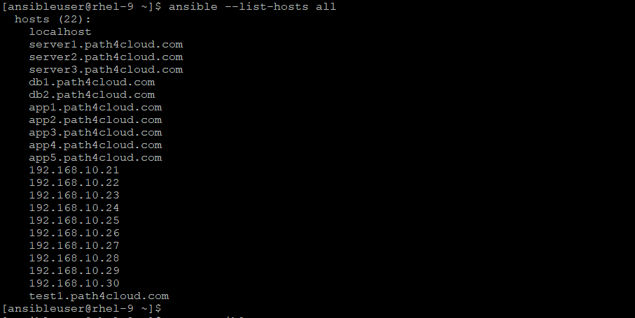

# Inventory = list of managed nodes (servers)
- It tells Ansible which hosts to manage and How to connect to them. And if there is any other host variable that we can defined here.
- Ansible has a global inventory file under /etc/ansible/hosts
```
cat /etc/ansible/hosts
# This is the default ansible 'hosts' file.
#
# It should live in /etc/ansible/hosts
#
#   - Comments begin with the '#' character
#   - Blank lines are ignored
#   - Groups of hosts are delimited by [header] elements
#   - You can enter hostnames or ip addresses
#   - A hostname/ip can be a member of multiple groups
```

## Types of Inventory
- Static Inventory
- Dynamic Inventory


1️⃣ Static Inventory
- A manually defined file where you list servers or hosts which you want to manage via hosts.
```
📄 Example (INI format)
    server1.path4cloud.com

    [web]     <<-- the name in [] square brackets represents the hostgroup name which is a group of hosts.
    server2.path4cloud.com
    server3.path4cloud.com

    [db]
    db1.path4cloud.com
    db2.path4cloud.com

    [app]     <<-- If server name is same and in range, we can specify like this.
    app[1:5].path4cloud.com

    [test]    <<-- this tesst group is having a range of IPs starting from 192.168.10.21 to 192.168.10.30
    192.168.10.[21:30]

    test1.path4cloud.com   <<-- Here, this test1 is also incorporated to test group since it is sitting under test group only
```
```
# cd setup_files
# cat inventory
# ansible --list-hosts all

We have few more flags with this command just to restrict to ungrouped or grouped hosts
# ansible --list-hosts ungrouped
  hosts (2):
    localhost
    server1.path4cloud.com

# ansible --list-hosts web
  hosts (2):
    server2.path4cloud.com
    server3.path4cloud.com
```


### Nested group in static inventory
Yes, we can grouped the host group as one single group as parent:children relationship
```
Let say, we want to group the web and db under one group called, nonprod then we can specify at the end of same inventory file:

[nonprod:children]
web
db


Lets verify:
#  ansible --list-hosts nonprod
  hosts (4):
    server2.path4cloud.com
    server3.path4cloud.com
    db1.path4cloud.com
    db2.path4cloud.com
```
```
📄 YAML format (modern)
We camn incporporate the hosts lists with new modern command ansible-inventory with many style, it will print the hosts list in json format by default.

# ansible-inventory --list (will print whole list of hosts from inventory)

# ansible-inventory --list | jq '{app: .app}' (will limit the list to app group only)
{
  "app": {
    "hosts": [
      "app1.path4cloud.com",
      "app2.path4cloud.com",
      "app3.path4cloud.com",
      "app4.path4cloud.com",
      "app5.path4cloud.com"
    ]
  }
}

 
# ansible-inventory --graph (will print the whole list in graph format)

# ansible-inventory --graph app (will list the list to app group only)
@app:
  |--app1.path4cloud.com
  |--app2.path4cloud.com
  |--app3.path4cloud.com
  |--app4.path4cloud.com
  |--app5.path4cloud.com
```


2️⃣ Dynamic Inventory
- Inventory is generated automatically from external sources
- Sources
  - Cloud providers (AWS, Azure, GCP)
  - Kubernetes
  - CMDB / APIs
  - RedHat Satellite
  - vSpeher/Nutanix
  - Active Directory
- We can use supported plugins for each provider to get the latest inventory.
- For an example, here we are using yaml file and aws_ec2 plugin to fetch the latest inventory.
    ```
    📄 Sample config
    plugin: aws_ec2
    regions:
        - ap-south-1
    filters:
        tag:Environment: dev
    
    then run this, it will process the latest inventory:
    # ansible-inventory -i aws_ec2.yml --list
    ```

- ✅ Characteristics
  - Auto-updated
  - Scales easily
  - No manual host entry

- Use Cases
  - Cloud environments
  - Auto-scaling systems
  - Large infrastructure


🔹 For Static Inventory, Ansible supports the tree structure as well, where we can create a parent directory and then sub directories according to environemnt or your use case and we can organize these.

        # mkdir -pv master_inventory/{dev,qa,prod}
        # tree -F master_inventiry
        master_inventory
        ├── dev
        ├── prod
        └── qa

- Now, we can create a subfile under these directories, might be according to platforms:

        # touch master_inventory/dev/{linux,windows,network}
        # touch master_inventory/qa/{web,db}
        # touch master_inventory/prod/{hosts}
        # tree -F master_inventory/
        master_inventory/
        ├── dev/
        │   ├── linux
        │   ├── network
        │   └── windows
        ├── prod/
        │   └── {hosts}
        └── qa/
            ├── db
            └── web 


🔹 Further, we can organize the hosts inside of inventory file into groups, and nested group (parent & child):

    Example:
        [linux]                         <----------- group_name which has servers list
        server1.path4cloud.com
        server2.path4cloud.com
        server[a:d].path4cloud.com      <----------- We can reference sequential range to put in []

        [webservers]
        web1.path4cloud.com
        web2.path4cloud.com

        [dbservers]
        db1.path4cloud.com
        db2.path4cloud.com
        oracledb[1:10].path4cloud.com

        [webapp:children]                <---------- This is nested group, we can put the nested_group name, follows by : and the keyword "children"
        webservers                       <---------- this is a real group, defined above with members of servers, here it is a child group
        dbservers                        <---------- this is a real group, defined above with members of servers, here it is a child group

        [onprem]
        server1.path4cloud.com           <---------- One server, can be part of many groups, here server1 is also part of linux group

        [cloud]
        servera.path4cloud.com           <---------- One server, can be part of many groups, here server1 is also part of linux group

        [all:children]                   <---------- And, one group can be part of multiple nested group as well
        linux
        webservers
        dbservers
        onprem
        cloud

        [network]                        <----------- We can reference the IP ranges as well
        192.168.[0.255].1                <----------- Here, it will include from 192.168.0.1 to 192.168.255.1 (all IPs)


🔹 Lets reference these different directories and subfiles for inventory with ansible-navigator command:

    # ansible-navigator inventory -i <path> -m stdout --list (in json format)

explore other inventory options:

    # ansible-navigator inventory -i <path> -m stdout --graph (will show all hosts and groups)
    # ansible-navigator inventory -i <path> -m stdout --graph  <group_name> (will show the hosts from specified group)
    # ansible-navigator inventory -i <path> -m stdout --host <hostname> (will list the all variables specified for this host inside inventory)
    (**Variable can be associated with inventory host or inventory group)
    # ansible-navigator inventory -i <path> -m stdout --graph ungrouped (will show the hosts that are not part of any group)
    # ansible-navigator inventory -i <path>  (will show the output interactively)