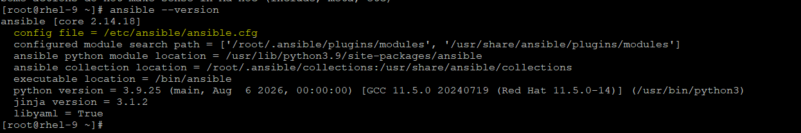
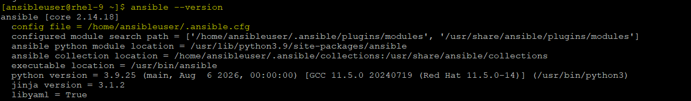
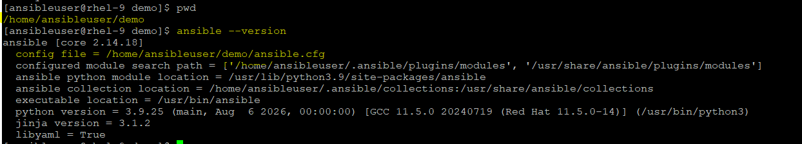
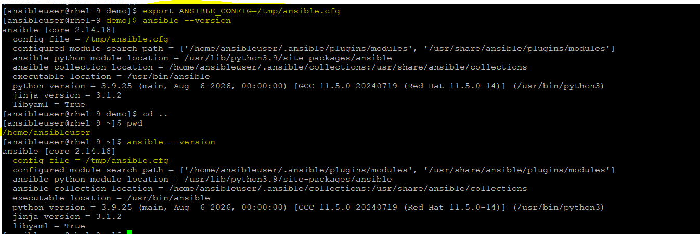
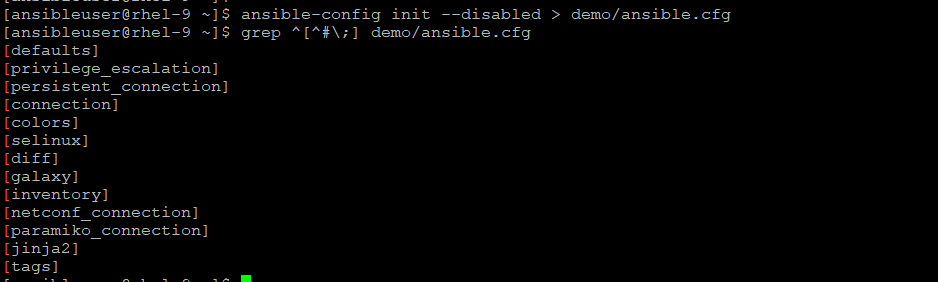
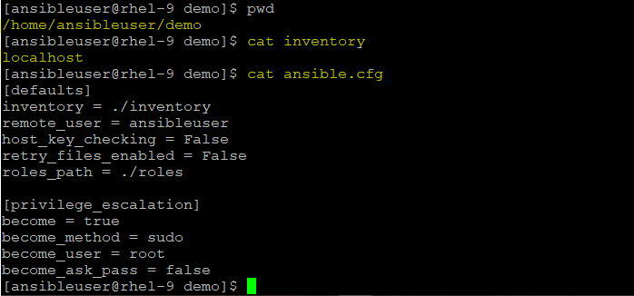
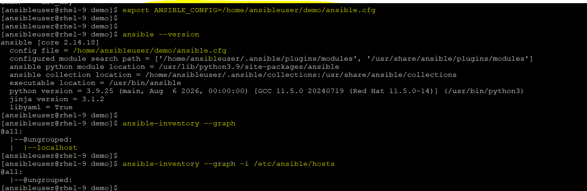

# Main Configuration file
ansible.cfg is the main configuration file for Ansible. It controls how Ansible behaves globally or per project.

### What does it do?
- It defines defaults like:
  - Inventory location
  - SSH user / key
  - Privilege escalation (sudo)
  - Roles path
  - Timeout & retries
  - Logging

### Why is it Important? 🔥
- Avoid repeating parameters instead of writing in every playbook.
- Standardization across team
- Cleaner playbooks
- Environment control: You can customize behavior per environment.

### Scope of ansible.cfg (VERY IMPORTANT)
- Ansible follows a priority order when loading config:
  - 🥇 1. Environment variable (ANSIBLE_CONFIG=/path/to/ansible.cfg)
  - 🥈 2. Current directory (./ansible.cfg, where the playbook will be executed)
  - 🥉 3. User home directory (~/.ansible.cfg, who run the playbook)
  - 🏁 4. System-wide config (/etc/ansible/ansible.cfg)

#### DEMO
- switch to a user (root) or any other user which does not have ansible.cfg file in his home directory then it will refer to a global config file.


- Switch to a user (ansibleiuser) who has ansible.cfg file is his home directory then it will refer to a user home directory. (Make a note of .ansible.cfg should be there if it is wihout . dot then will not be considered)


- now, go a directory which holds the ansible.cfg (without . dot) then it will consider the main config file from same directory


- Top priroity is being given to command line variable `ANSIBLE_CONFIG`, whatever is path being set to this variable then irrespective to any directory it will consider the main config from that path. export the path to this variable.



## Examine ansible config file sections
```
Since Ansible 2.12 (core):
To generate an example config file (a "disabled" one with all default settings, commented out)
# ansible-config init --disabled > ansible.cfg

Also you can now have a more complete file by including existing plugins:
# ansible-config init --disabled -t all > ansible.cfg
```

This ansible.cfg file contains the standard configuration headers used to customize how Ansible behaves on your system. 
- [defaults]: The most critical section. It defines core operational behaviors like where to find your server list (inventory), the default remote user to log in as (remote_user), SSH timeout limits, and path locations for external modules or roles.
- [privilege_escalation]: Controls how Ansible gains administrative (root) privileges on remote targets. Under this header, you define if it should use sudo (become=True), what method to use (become_method=sudo), and whether it should prompt you for a root password.
- [inventory]: Configures how Ansible handles its target host lists. You use this to enable specific inventory caching plugins, ignore specific file extensions when reading inventory directories, or configure how host variables are parsed.
- [connection]: Fine-tunes the underlying transport mechanism (usually native OpenSSH) used to talk to remote nodes. Here you can tweak SSH arguments, control how often connection retries occur, or manage strict host key checking.
- [persistent_connection]: Manages persistent, long-running SSH tunnels. This is primarily used to control timeout values for background control processes, ensuring connections to slow or latent targets stay alive during long plays.
- [netconf_connection]: A highly specific section dedicated to network hardware (like Cisco or Juniper routers). It tunes parameters for the NETCONF protocol, such as specialized SSH buffers and XML-based data transfer timeouts.
- [paramiko_connection]: Configures the older, Python-based paramiko SSH client library. Ansible only falls back to this if your control node completely lacks a native OpenSSH binary (very rare on modern Linux).
- [colors]: Customizes the visual terminal interface. You can change what color code appears for screen output states—such as bright green for unchanged tasks (ok), yellow for system modifications (changed), and red for fatal errors (failed).
- [diff]: Controls the unified "diff" view framework. Enabling always = True here forces Ansible to print a plain-text comparison showing exactly what lines are changing inside files (like sshd_config) before it writes them to disk.
- [tags]: Manages how Ansible handles task orchestration tags. You can set global play behaviors here, such as always executing specific tasks or automatically skipping tags unless explicitly requested via the command line.
- [selinux]: Manages target file security contexts. If your RHEL target runs SELinux in enforcing mode, this dictates whether Ansible should use specialized tools (like chcon) to automatically update file context types during file copies.
- [galaxy]: Configures settings for Ansible Galaxy (the public/private automation community repository). It defines download timeout limits, secure API access tokens, and the server URL paths used to pull third-party roles and collections.
- [jinja2]: Optimizes the internal Jinja2 templating engine. You can use this to toggle strict string parsing behaviors or explicitly enable specific extension components for evaluating programmatic logic inside your YAML code.


## Demo: Customize the ansible.cfg
```
[defaults]
inventory = ./inventory
remote_user = ansibleuser
host_key_checking = False
retry_files_enabled = False
roles_path = ./roles

[privilege_escalation]
become = true
become_method = sudo
become_user = root
become_ask_pass = false
```
- once we have customized the ansible.cfg as above then we can set it to default config file.

- We can verify the same with `ansible --version` and then we can try to operate the default file and we can see the it is picking the same inventory file defined in this config file, if we want to list another inventory then we can set it with `-i` flag with same command.


  - 🔹 Pro Tips
    - Always keep ansible.cfg inside project repo
    - Disable host_key_checking for lab (not prod)
    - Use roles_path for modular design
    - Use log_path for debugging
    - boolen values can be accpeted as true/True/1/yes/Yes OR false/False/0/no/No, but to keep consistency follow one value like we are keeping it as `true` or `false`

# ansible-config command 
```
To check the all valid parameter with env variable and its default value with description, run this:
# ansible-config list
ACTION_WARNINGS:
  default: true
  description:
  - By default Ansible will issue a warning when received from a task action (module
    or action plugin)
  - These warnings can be silenced by adjusting this setting to False.
  env:
  - name: ANSIBLE_ACTION_WARNINGS
  ini:
  - key: action_warnings
    section: defaults
  name: Toggle action warnings
  type: boolean
  version_added: '2.5'
...
(output omitted)

To get the same default variable and its value, use this:
#  ansible-config dump
ACTION_WARNINGS(default) = True
AGNOSTIC_BECOME_PROMPT(default) = True
ANSIBLE_CONNECTION_PATH(default) = None
...
(output omitted)

We can grep the filter:
# ansible-config dump | grep -i remote_user
DEFAULT_REMOTE_USER(/home/ansibleuser/demo/ansible.cfg) = ansibleuser

To check the current config file:
#  ansible-config view
[defaults]
inventory = ./inventory
remote_user = ansibleuser
host_key_checking = False
retry_files_enabled = False
roles_path = ./roles

[privilege_escalation]
become = true
become_method = sudo
become_user = root
become_ask_pass = false
```