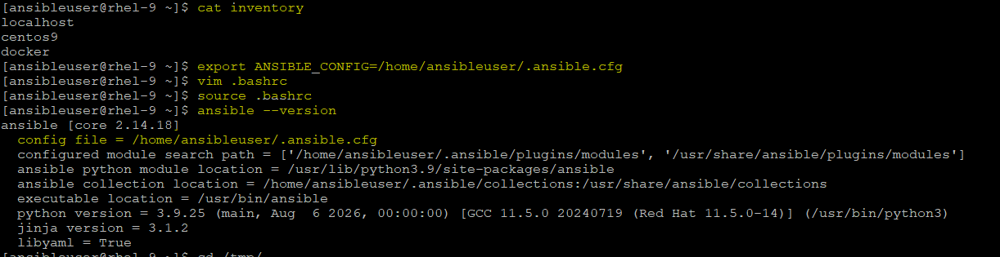
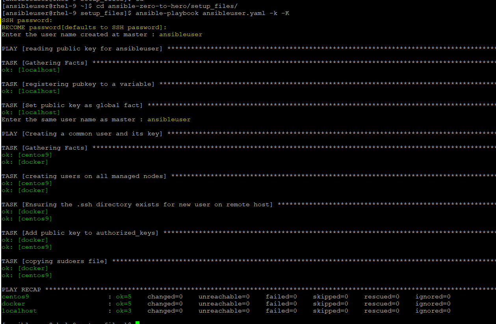
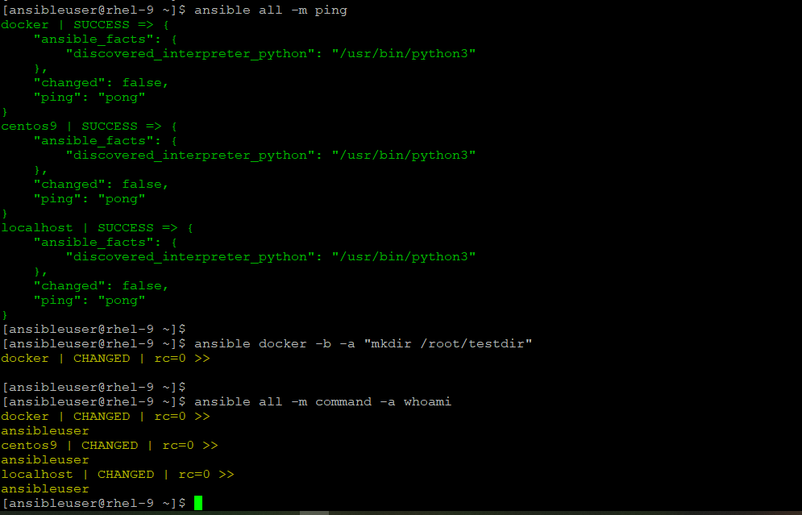
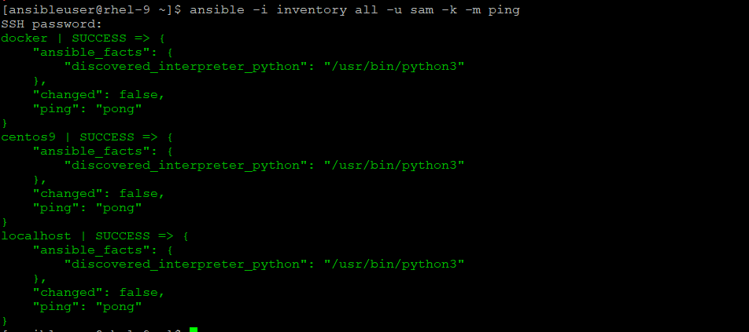

✅ Please follow the below steps to configure the ansible master/controller node

1) Create a dedicated user for ansible, I am using ansibleuser and this user must have a sudo privileges.
2) SSH connection to be there between controller node and targeted nodes
3) Python must be there on all nodes.
4) If using hostname then name resolution via DNS or /etc/hosts file.
5) Create inventory file on controller node and ansible.cfg file for default configurations and parameters.

✅ My LAB Setup

- Controller Node: 
    - running on RHEL9 and registered to REDHAT CDN with Developer Subscription.
    - ansible-core [2.14.18] installed
    - ansible-navigator [26.8.0] installed
    - Container Image repositories (registry.redhat.io) configured and logged in
    - Updated the /etc/hosts file of all servers with IP and hostname for all servers to connect with hostname if required, else IP is suffice to work

- Managed Node:
    - Ubuntu [24.04]
        - ssh service is running ($ systemctl status ssh) (and if any firewall then should be allowed)
        - python is installed ($ sudo dpkg --get-selections python3)
    - CentOS [centos9]
        - ssh service is running ($ systemctl status sshd) (and if any firewall then should be allowed)
        - python is installed ($ sudo rpm -qa python3)


- User to connect with managed hosts:
    - ansibleuser (keybased authentication and added to sudo privileges)

## DEMO
1) Login with root and then create a new user on ansible control node:
    ```
    # useradd ansibleuser
    # passwd ansibleuser
    # su - ansibleuser (switching to a new user)
    # ssh-keygen (creating a SSH KEY)
    # cp id_rsa.pub authorized_keys (copy the public key for ansibleuser to make the password less connection at localhost)
    ```
2) Clone the repo under ansibleuser home directory:
    ```
    "as asibleuser"
    $ git clone https://github.com/amitaryan0010/ansible-zero-to-hero.git

    "as root user"
    Copy the "ansibleuser" file from cloned repo to /etc/sudoers.d/ (with root)
    # cd /home/ansibleuser/ansible-zero-to-hero/setup_files/ 
    # cp ansibleuser /etc/sudoers.d/

    Note: If you have another user then replace the "ansibleuser" with your username
    # sed -i "s|ansibleuser|<new_user>|g" ansibleuser
    ```

3) Copy and rename the config files to ansibleuser home directory as hidden files:
    ```
    "as asibleuser"
    $ cd ansible-zero-to-hero/setup_files
    $ cp ansible.cfg /home/ansibleuser/.ansible.cfg
    (change the remote_user, if you have created an another user in step2)

    $ cp ansible-navigator.yaml /home/ansibleuser/.ansible-navigator.yaml

4) Create the inventory file under ansibleuser home directory and update with your target hostname or IP:
    ```
    $ touch inventory
    Update the target node
    $ cat inventory 
    localhost ansible_connection=local
    # localhost
    
    [target_node]
    centos9
    docker
    ```


5) Now, run the playbook ansibleuser.yaml from ansibleuser home directory. This playbook prompt for username, provide the user as "ansibleuser" (OR, if you have created another user then provide the same username)
    ```
    Note: If you have another user which is already present in target node and have sudo privilege then at line num 20, replace the "path4cloud" user to an user which is already present in targer hosts.

    Set the config file as environment variable for default config.
    $ export ANSIBLE_CONFIG=/home/ansibleuser/.ansible.cfg

    To make this persistant, add an entry in .bashrc profile of this user.
    echo "export ANSIBLE_CONFIG=/home/ansibleuser/.ansible.cfg" >> .bashrc

    Verfiy the default config file:
    $ ansible --version

    Now, run the playbook from setup_files directory, it will ask the password for ansible user twice here, -k to ssh, -K to become sudo:
    $ cd ansible-zero-to-hero/setup_files/ 
    $ ansible-playbook ansibleuser.yaml -k -K 
    ```
    

    
6) Check the new user is working with privilege access or try to ping as adhoc command:
    ```
    $ ansible all -m ping
    
    (here docker is my managed host and already mentioned in inventory file, you can change it to your name. -b is used to become the sudo if you have false set for become in config file))
    $ ansible docker -b -a "mkdir /root/testdir" 

    $ ansible all -m command -a whoami 
    (Here, it will show as root, but to follow best practices - change "become = true" to "become = false" in .ansible.cfg file under user home directory and set it true explicity in playbook whereever its required.)
    ```
    

## Another method to set the user for ssh
- A Quick Setup using ansible only, if you have a user present on target node with sudo privilege
- On master node:
    ```
    $ ansible -i inventory all -u <remote_user> -k -b -K -m user -a "name=<user_name> state=present create_home=yes"
    (here -u remote_user is which is already present on target node, and user_name with useradd command is the user which you want to create on target node)

    $ ansible -i inventory <linux_host> -u <user_name> -k -b -K -m shell -a "echo <password> | passwd --stdin <user_name>"
    (here, we are setting the password for an user, created in step1 on linux host, we used, shell module, since this standard redirecting won't work with 'command' module)

    (we ran only for Linux Hosts since for Ubuntu, it is a different command to set the password)

    $ ansible -i inventory <ubuntu_host> -u <user_name> -k -b -K -m shell -a "echo <user_name>:<password> | chpasswd"

    (here, we are adding the new user to sudo privilege using copy module)
    $ ansible -i inventory all -u <user_name> -k -b -K -m copy -a 'content="<user_name> ALL=(ALL) NOPASSWD: ALL" dest=/etc/sudoers.d/<user_name>'

    Once done, we can try to ping with new user:
    $ ansible -i inventory all -u <user_name> -k -m ping
    ```    
    I have created sam user for all hosts and tried to ping with sam:
    

## How localhost work with classic ansible as managed host
- Using classic ansible command with keys
```
Copy the SSH keys for a user to work it over SSH connection and put the localhost in inventory

$ cat inventory
#localhost ansible_connection=local
localhost

[target_node]
docker
centos9

$ ansible localhost -m ping
localhost | SUCCESS => {
    "ansible_facts": {
        "discovered_interpreter_python": "/usr/bin/python3"
    },
    "changed": false,
    "ping": "pong"
}
```
- Using classic ansible command without keys
```
No need to copy SSH keys for a user, it will work if localhost was defined in your inventory with ansible_connection=local, Ansible skipped SSH entirely beacuse it uses local Python execution. No SSH, no keys, and no passwords required. It will succeed instantly.

$ cat inventory
localhost ansible_connection=local
#localhost

[target_node]
docker
centos9

$ ansible localhost -m ping
localhost | SUCCESS => {
    "ansible_facts": {
        "discovered_interpreter_python": "/usr/bin/python3"
    },
    "changed": false,
    "ping": "pong"
}
```
## How localhost work with ansible navigator as managed host
- We have already copied the ansible-navigator.yaml file, now we need to set it to as default:
```
Set the config file as environment variable for default config.
$ export ANSIBLE_NAVIGATOR_CONFIG=/home/ansibleuser/.ansible-navigator.yaml

To make this persistant, add an entry in .bashrc profile of this user.
echo "export ANSIBLE_NAVIGATOR_CONFIG=/home/ansibleuser/.ansible-navigator.yaml" >> .bashrc
```
- Verify the path:
```
$ ansible-navigator exec -- ansible --version
ansible [core 2.16.19]
  config file = /home/ansibleuser/.ansible.cfg
  configured module search path = ['/home/runner/.ansible/plugins/modules', '/usr/share/ansible/plugins/modules']
  ansible python module location = /usr/local/lib/python3.12/site-packages/ansible
  ansible collection location = /home/runner/.ansible/collections:/usr/share/ansible/collections
  executable location = /usr/local/bin/ansible
  python version = 3.12.13 (main, Jul 10 2026, 00:00:00) [GCC 11.5.0 20240719 (Red Hat 11.5.0-14)] (/usr/bin/python3.12)
  jinja version = 3.1.6
  libyaml = True
```

- To ping/check hostname, container, as ansible_connection=local
```
$ cat inventory
localhost ansible_connection=local

$ ansible-navigator exec -- ansible localhost -m setup -a "filter=ansible_hostname"
localhost | SUCCESS => {
    "ansible_facts": {
        "ansible_hostname": "c78a25303a99",
        "discovered_interpreter_python": "/usr/bin/python3"
    },
    "changed": false
}

$ ansible-navigator exec --container-options="--net=host" -- ansible localhost -m setup -a "filter=ansible_hostname"
localhost | SUCCESS => {
    "ansible_facts": {
        "ansible_hostname": "rhel-9",
        "discovered_interpreter_python": "/usr/bin/python3"
    },
    "changed": false
}

--container-options="--net=host": This breaks down the network isolation wall. By default, Podman/Docker creates a private virtual network for the container. The --net=host flag tells the container engine: "Do not isolate the network. Let this container share the host's exact network interface."The result: When Ansible inside the container tries to SSH into localhost:22, it routes directly to the physical RHEL-9 host machine's SSH daemon. Assuming your container has the correct SSH keys mounted to authenticate, it will successfully connect to and manage your host machine.

To make the --net=host setting permanent, you need to use the container-options parameter inside your ansible-navigator.yaml

execution-environment:
    image: registry.redhat.io/ansible-automation-platform-26/ee-supported-rhel9:latest
    pull:
      policy: missing
    # Add these lines right here
    container-options:
      - "--net=host"
```
- inside container, it will not work without ansible_connection=local beacuse it requies SSH Keys inside the container.
```
$ ansible-navigator exec -- ansible localhost -m setup -a "filter=ansible_hostname"
localhost | UNREACHABLE! => {
    "changed": false,
    "msg": "Failed to connect to the host via ssh: ssh: connect to host localhost port 22: Connection refused",
    "unreachable": true
}

** Ansible inside the container tried to SSH to localhost:22 inside its own container network loopback. Since the execution environment container is not running an SSH server daemon on port 22 inside itself, the connection was instantly knocked back with a Connection refused error.

$ ansible-navigator exec --container-options="--net=host" -- ansible localhost -m setup -a "filter=ansible_hostname"
localhost | SUCCESS => {
    "ansible_facts": {
        "ansible_hostname": "rhel-9",
        "discovered_interpreter_python": "/usr/bin/python3"
    },
    "changed": false
}
```