# Ansible Navigator:
- It is an interface to legacy or old ansible commands like config, doc, inventory. Now, we can use ansible-navigator to deal with this all commands.
- It uses the execution environment which is a container image file as a single file (comes as tar ball). And inside of this single file, you would have all files, all resources that are needed by your application, here it is ansible.
- execution environment image where we have ansible (version), collection and modules.
- If we have legacy playbook which requires a older version of Ansible then we can build our own image for execution environment and install the required modules and use this image to run those old playbooks.
- These images are being hosted at registry, that might be internal registry, or redhat registry or public registry (docker hub)

### Login to registry as:
    # podman login -u <usernam> -p <password> <registry_url>

### To install the ansible navigator
    # subscription-manager repos --enable=ansible-automation-platform-2.6-for-rhel-9-x86_64-rpms
    (here, we are enabling 2.6 version, you can choose as per your requirement)
    # yum install ansible-navigator -y

### Once installed, we can check the execution environemnt 
    # ansible-navigator images
    (will fetch the image if not available locally from configured repository, if already there then it can launch the Eexcution environemnt- EE and we can explore with menu options, displayed at the bottom of the screen)


## Setup the Ansible Navigator Environment:
```
# podman login registry.redhat.io
Username: path4cloud
Password:
Login Succeeded!

# podman search ansible-automation-platform-24 (look for EE images for your ansible and rhel version)

# podman pull registry.redhat.io/ansible-automation-platform-24/ee-supported-rhel9
# podman pull registry.redhat.io/ansible-automation-platform-24/ee-supported-rhel8

# ansible-navigator images
(We have ansible-navigator.yaml file, similar as ansible.cfg where we have paramater defined for ansible-navigator)
(For this version, ee-supported-rhel9 is the default image and if policy is set to 'always' then everytime it will pull the images from registry, we can set to never or missing in ansible-navigator.yaml file) 
```

### Additional uses:
```
# ansible-navigator run < > (to run the ansible playbook)
# ansible-navigator inventory < > (to manipulate or explore the inventory)
# ansible-navigator config < > (to list the current configured navigator settings)
```

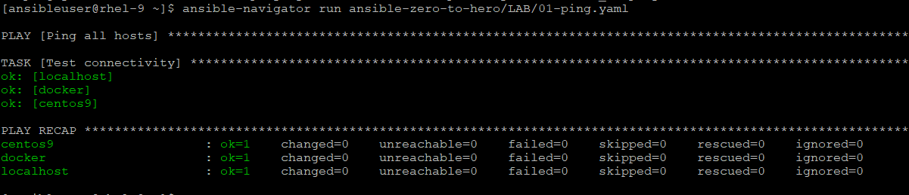

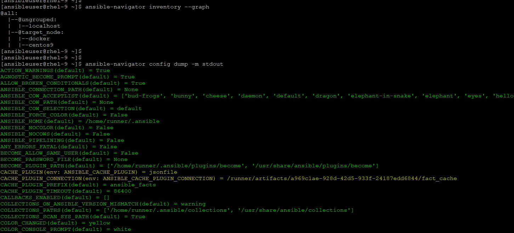

## Managing Ansible Navigator Configuration file
- Settings for ansible-navigator can be provided on the command line, set using an environment variable or specified in a settings file.
- The settings file name and path can be specified with an environment variable or it can be placed in one of two default directories.
- Priority order:
    - ANSIBLE_NAVIGATOR_CONFIG (settings file path environment variable if set)
    - ./ansible-navigator.yaml (project directory) (NOTE: no dot in the file name)
    - ~/.ansible-navigator.yaml (home directory) (NOTE: note the dot in the file name)

- Note:
    - The settings file can be in JSON or YAML format.
    - For settings in JSON format, the extension must be .json.
    - For settings in YAML format, the extension must be .yml or .yaml.
    - The project and home directories can only contain one settings file each.
    - If more than one settings file is found in either directory, it will result in an error.

- We can create a sample file with example settings:
    
        # ansible-navigator settings --sample > myconfig.yaml
        
### Common Settings
```
---
ansible-navigator:
  ansible:
    inventory:
	  entries:
	  - <path of inventory file>
	  - <path of another inventory file> (optional, we can specify multiple inventory files)
  execution-environment:
    image: registry.redhat.io/ansible-automation-platform-23/ee-supported-rhel8:latest
	pull:
	  policy: missing
  playbook-artifact:
    enable: false
  mode: stdout
```
[check here for more paramater for ansible-navigator config file](https://ansible.readthedocs.io/projects/navigator/settings/)

### explore inventory options:
```
# ansible-navigator inventory -i <path> -m stdout --list (in json format)
# ansible-navigator inventory -i <path> -m stdout --graph (will show all hosts and groups)
# ansible-navigator inventory -i <path> -m stdout --graph  <group_name> (will show the hosts from specified group)
# ansible-navigator inventory -i <path> -m stdout --host <hostname> (will list the all variables specified for this host)
# ansible-navigator inventory -i <path> -m stdout --graph ungrouped (will show the hosts that are not part of any group)
# ansible-navigator inventory -i <path>  (will show the output interactively)

✅ more

# ansible-navigator config dump -m stdout (dump the current configuration)
# ansible-navigator doc -m stdout -latest (will list the collections)
# ansible-navigator collection list (will display the collection inside the execution-environment)
# ansible-navigator run <playbook.yaml> (will run the playbook inside container)
# ansible-navigator run <playbook> --playbook-artifact-enable false --vault-id @prompt
(if you are using --vault-id @prompt with navigator then we need to pass artifact false option as above else command will goanna hung indefinitly or you have explicitly defined to false in navigator.yaml file but sometimes, it is very useful when a playbook deosn't prompt for the password, these artifacts helps us to run the last execution if it failed.)
# ansible-navigator replay
or
:replay (in interactive mode)

** If default values are not  provided by a configuration file, they must be specified on the command line.
** By default, ansible-navigator runs in interactive mode, use -m stdout to get the task display on console or set this paramater (mode: stdout) in configuration file.
```

## Set path for ansible.cfg for Execution Environment
- If we want to include the ansible.cfg to be read by ansible-navigator.yaml then we need to create the ansible.cfg file in same project directory where we are running ansible-navigator command since it mounts the same project directory inside the container and if ansible.cfg is outside of project directory then container can't see it.
    - When ansible.cfg file is outside of project directory:
    ```
    - we can dump the config and check the HOST_LIST paramater in interactive mode or grep the config_file.
    - when an ansible.cfg file outside of project directory, it mounts the default from /etc/ansible/ansible.cfg from container
    $ ansible-navigator config dump | grep CONFIG_FILE
      CONFIG_FILE() = None
    
    $ ansible-navigator config dump -m stdout (will show all paramater, search for HOST_LIST with : in command mode)
            DEFAULT_HOST_LIST(default) = ['/etc/ansible/hosts']
    ```

    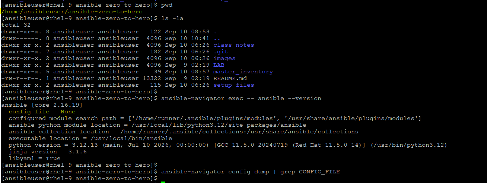

    - When an ansible.cfg inside of project directory, it mounts the same inside the container
    ```
    $ ansible-navigator config dump | grep CONFIG_FILE
      CONFIG_FILE() = /home/ansibleuser/.ansible.cfg
    $ ansible-navigator config dump -m stdout (will show all paramater, search for HOST_LIST with : in command mode)
    DEFAULT_HOST_LIST(/home/ansibleuser/.ansible.cfg) = ['/home/ansibleuser/inventory']
    ```

    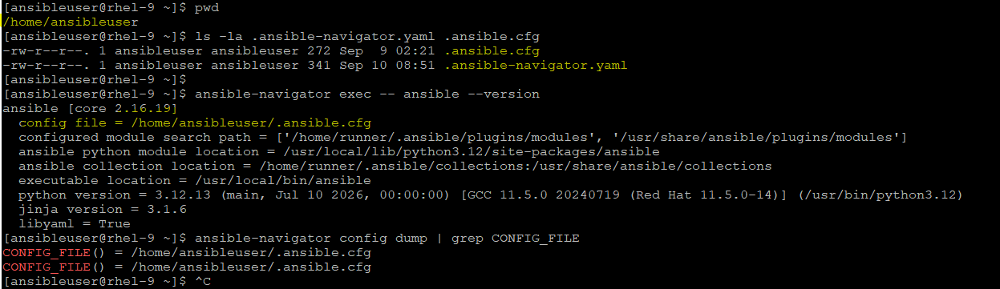

    - Even we can put it in ansible-navigator.yaml as config paramater but still, it will not mount that:
    ```
    $ cat ansible-navigator.yaml
    ansible:
      config:
        path: /home/ansibleuser/.ansible.cfg
    
    $ ansible-navigator config dump | grep CONFIG_FILE
    ```
    - We can check inside the container, when ansible.cfg is out of project directory:
    ```        
    $ ansible-navigator exec -- ansible --version
    ```
    - We can check inside the container, when ansible.cfg is inside of project directory:
    ```
    $ ansible-navigator exec -- ansible --version
    ```

    - and here is another proof, that it reads the ansible.cfg inside of project directory while checking inventory:
    ```
    $ ansible-navigator inventory -m stdout --graph all
        @all:
        |--@ungrouped:
        |  |--localhost
        |--@target_node:
        |  |--docker
        |  |--centos9

    $ pwd
    /home/ansibleuser/ansible-ops
    $  cat ansible.cfg
    [defaults]
    inventory = /home/ansibleuser/inventory
    ```

##  Providing required collections for ansible-navigator
- By default, few collections are already included in ansible-navigator
- To use collections that are not part of by default:
    ```
    # ansible-navigator --eei (this flag can refer to another execute environemnt that is available)
    # ansible-galaxy collection install (to install the collection into project directory)
    # ansible-builder (This utility helps to create custom execute environemnt)
    ```
    
## LAB to work on missing collection in execution environemnt:
- We have 'install_httpd.yml' file in our github repo, let try to run that with minimal image
    ```    
    # ansible-navigator run install_httpd.yaml --eei registry.redhat.io/ansible-automation-platform-24/ee-minimal-rhel9:latest

    It will fail with "ERROR! couldn't resolve module/action 'community.general.seport'"
    Exact Error output:
        ERROR! couldn't resolve module/action 'community.general.seport'
        This often indicates a misspelling, missing collection, or incorrect module path.

    Why It's failed:
        - Your EE environemnt does not contain this collection since EE environemnt is an isolated container and it does not use system-installed collections
    ```
    
    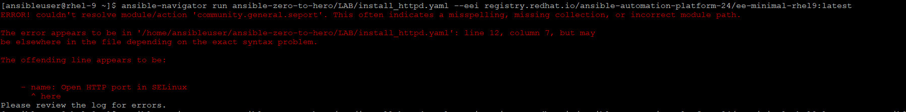

- We can fix this issue:
    - Fix 1:
        - Create a directory under project folder with name "collections" or use the default path for collections which is '/home/ansibleuser/.ansible/collections:/usr/share/ansible/collections' and then install the collection locally on your system.
            - If we try to install at custom directory then we need to set the path with `-p` flag in command:
                ```
                $ ansible-galaxy collection install community.general -p ./collections
                Starting galaxy collection install process
                [WARNING]: The specified collections path '/home/ansibleuser/collections' is not part of the configured Ansible collections paths
                '/home/ansibleuser/.ansible/collections:/usr/share/ansible/collections'. The installed collection will not be picked up in an Ansible run, unless within a playbook-adjacent collections directory.
                - if it is already installed at default path then use --force.
                ```

        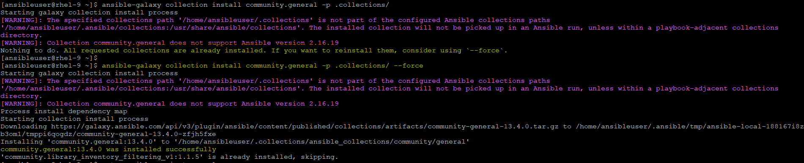

            - If we are trying to install at default path:
                ```
                $ ansible-galaxy collection install community.general -p .ansible/collections/ansible_collections/ --force

                (Use --force, if it is already installed at "/usr/share/ansible/collections/ansible_collections/" or corrupted)
                ```

        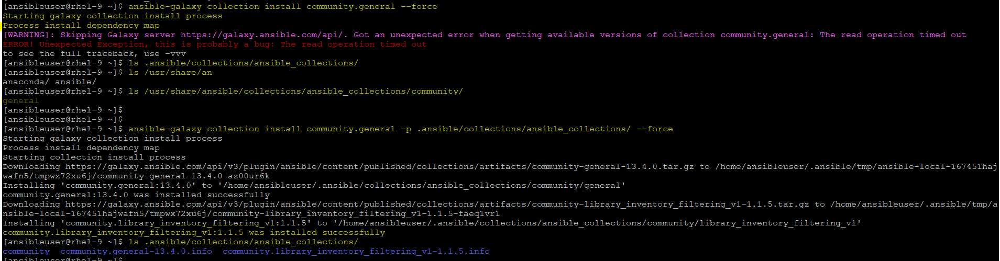

        - Post installation locally, then we can mount the same inside the container while running the run commnad:

            ```
            $ ansible-navigator run ansible-zero-to-hero/LAB/install_httpd.yaml --eei registry.redhat.io/ansible-automation-platform-24/ee-minimal-rhel9:latest --container-options="-v=/home/ansibleuser/.ansible/collections:/home/runner/.ansible/collections:Z" --container-options="--net=host" --senv ANSIBLE_COLLECTIONS_PATH=/home/runner/.ansible/collections

            (usually, it is not a good idea, it might raise an another issue like python dependecny like here)
            ```

        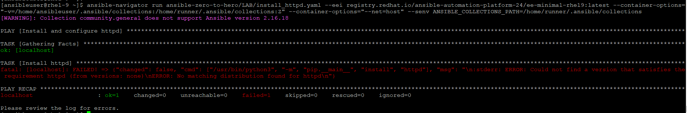

        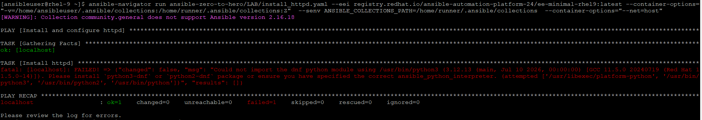

            - Additional option with `--container-options`
                -  The Volume Mount (-v=...)
                    - -v (Volume): This tells the container engine to share a folder from your physical computer with the container.
                    - Left Side (/home/ansibleuser/.ansible/collections): The path to the folder on your physical host machine where your custom collections are installed.
                    - Right Side (/home/runner/.ansible/collections): The folder location inside the container where you want that host folder to appear.
                    - :Z (SELinux Flag): This is highly critical for RHEL / CentOS. It instructs SELinux to automatically relabel the security context of the folder. Without :Z, the container would block the file access and throw a "Permission Denied" error.
                    - Summary: It copies nothing, but creates a real-time window allowing the container to read files inside your hidden host .ansible directory.
                - The Environment Variable (-e=...)
                    - -e (Environment Variable): This injects a configuration variable directly into the container's shell environment (similar to running export VAR=value).
                    - ANSIBLE_COLLECTIONS_PATH: This is a built-in variable that Ansible Core reads to know where to search for modules.
                    - /home/runner/.ansible/collections: This tells Ansible inside the container: "Hey, look inside this specific folder to find extra playbooks/plugins." (Which is the exact path we mounted in step 1).
                    - Summary: Mounting the folder isn't enough because Ansible doesn't look there by default. This line acts as a road sign pointing Ansible's engine directly to the newly mounted folder.

    - Fix 2:
        - Use the fully qualified collection name, if you used short name

    - Fix 3:
        - Use the correct EE image which has this collection already installed or mount it as we did above which refer the locally installed collection while running playbook.
        - verify the collection if installed:
        
                # ansible-navigator exec --eei my-ee:latest -- ansible-galaxy collection list

        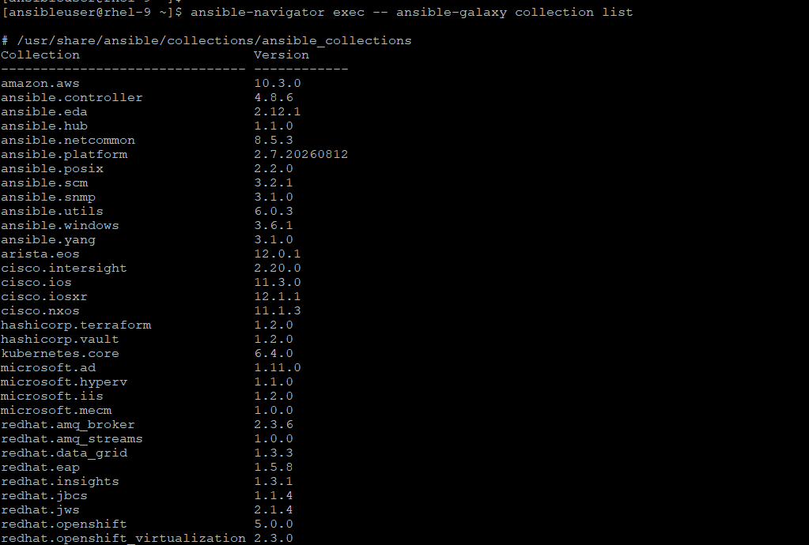

        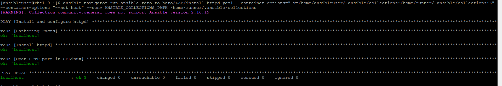
        
    - Fix 4:
        - Create custom EE image with missing library or dependency. Follow below steps to create a custom EE:
            1.  Install ansible-builder: 
            
                `sudo dnf install ansible-builder -y`

            2. Create a Project Directory:
            
                `mkdir ~/my_custom_ee && cd ~/my_custom_ee`

            3. Create [requirements.yaml](../LAB/requirements.yml) file and put the all required collection name inside it.
                ```
                $ cat requirements.yml
                ---
                collections:
                  - name: community.general
                ```

            4. Create a file named [bindep.txt](../LAB/bindep.txt) to declare the missing system library
                ```
                python3-dnf [platform:rpm]
                psycopg2-binary
                ```
            5. Create the [execution-environment.yml](../LAB/execution-environment.yml) file
                ```
                ---
                version: 3

                images:
                  base_image:
                    name: registry.redhat.io/ansible-automation-platform-27/ee-minimal-rhel9:latest

                dependencies:
                galaxy: requirements.yml
                system: bindep.txt
                ```
            6. Build the Image
                - Run the builder command. This compiles your custom dependencies over the minimal image and saves it locally:
                - `# ansible-builder build -t <custom_name_of_image>:latest`

                        $ ansible-builder build -t my-custom-ee:1.0

                    (Note: Ensure you are logged into Podman via podman login registry.redhat.io before running this so it can pull the base image).


        Another Common Failure Example: Missing Python dependency
            - for an example, we have this task in our playbook:
                - name: Create PostgreSQL DB
                  community.postgresql.postgresql_db:
                    name: testdb

            - It might land with this error. (Even if collection exists → Python lib missing in EE)
                psycopg2 is not installed 

            - Fix:
                create requirement.yaml and put "psycopg2-binary" and rebuild the EE image.

