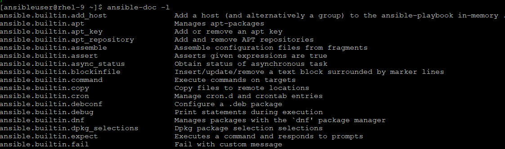
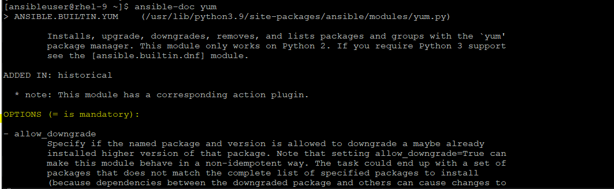
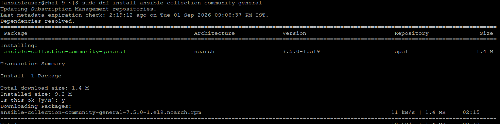

# Ansible Modules
- In Ansible, a module is a small unit of work that performs a specific task on a managed node.
    - Task = “What to do”
    - Module = “How it gets done”

## How Modules Work (Execution Flow)
- You write a task using a module in a playbook
- Ansible connects to the target host (SSH/WinRM/etc.)
- The module runs on the remote system
- Returns JSON output (changed/ok/failed)
- Example
    
        - name: Install nginx
          apt:
            name: nginx
            state: present

- Default (Built-in) Modules in Ansible, ships with hundreds of built-in modules.
- Common Core Modules

    | Category | Examples                       |
    | -------- | ------------------------------ |
    | Package  | `apt`, `yum`, `dnf`, `package` |
    | File     | `copy`, `file`, `template`     |
    | Service  | `service`, `systemd`           |
    | User     | `user`, `group`                |
    | Command  | `command`, `shell`             |

- How to See Available Modules
        
        # ansible-doc -l

    
- How to check documentation for a module
    
        # ansible-doc <module_name>
    

- we can install the additional collections as well from comunity or from repo:

        # ansible-galaxy collection install community.general
        OR
        # dnf install ansible-collection-community-general
    

## Few more options to ansible documentation:
- View Available Plugin Types: To see a complete list of all the plugin types you can query with the -t flag, 
        
        # ansible-doc -F

-  Common Usage Cheat Sheet by Category
    - **Modules (Default Type)**: Modules are the most common type. You don't actually need -t for them, but you can explicitly specify them. 
        
            # ansible-doc -t module user (or simply ansible-doc user)
    - **Lookup Plugins**: Lookups are used to query data from outside sources (like files, environment variables, or databases) inside a playbook.
    
            # ansible-doc -t lookup file
    - **Filter Plugins**: Filters allow you to manipulate data format and text inside Jinja2 expressions (like parsing JSON, hashing passwords, or altering strings).
    
            # ansible-doc -t filter b64encode
    - **Connection Plugins**: These dictate how Ansible transports commands to your target nodes.
    
            # ansible-doc -t connection ssh
    - **Playbook Keywords**: Keywords are the structural terms used to build playbooks (like loop, become, vars, or handlers).
    
            # ansible-doc -t keyword loop

- List Everything Available: If you want to see a massive list of all available plugins of a certain type installed on your RHEL system, use the -l (list) flag:

        # ansible-doc -t filter -l
        # ansible-doc -t module -l
- Get a Quick Summary: If you don't want to scroll through a massive manual page and just want a quick copy-pasteable YAML syntax block for a module, use the -s (snippet) flag:

        # ansible-doc -s user
    
## 🔗 Understanding Connection Module

    🐧 Linux (Default)
        Connection: SSH
        Plugin: ssh
        Example to put in inventory file:
            <server_ip> ansible_user=<user_name>

    🪟 Windows
        Connection: WinRM
        Plugin: winrm
        Uses PowerShell
        Requires WinRM setup
        Example to put in inventory file:
            <server_ip> ansible_user=<user_name> ansible_connection=winrm

    ☸️ Kubernetes
        Modules come from collection: kubernetes.core
        Connection type: API-based (not SSH)
        Install: # ansible-galaxy collection install kubernetes.core
        Example to put in playbook file:
        - name: Create pod
          kubernetes.core.k8s:
             state: present

    🔴 OpenShift
        Modules come from collection: community.okd or kubernetes.core
        Works via API (same as Kubernetes)


### What is an Ansible Collection?
- An Ansible Collection is a structured package that bundles everything Ansible needs in one place.
- A group of modules, plugin, roles comes as a Library.
```
📁 Example structure
    my_namespace/
    └── my_collection/
        ├── plugins/
        │   └── modules/
        ├── roles/
        ├── playbooks/
        └── docs/
```
- Ansible-Galaxy hosts collections like: amazon.aws, community.general, kubernetes.core
- Ansible Automation Hub hosts verified and certified collections from Redhat and it's partner.

- Ansible (Redhat) recommends FQCN = Fully Qualified Collection Name
    ```
    Format: <namespace>.<collection>.<module>
            amazon.aws.ec2_instance
            <provider>.<collection>.<module>
    ```
- Why FQCN is Important?
    - Multiple collections may have same module name, by using FQCN, it solves the problems.
    Better readability. You instantly know: 
        - where module comes from
        - what it belongs to