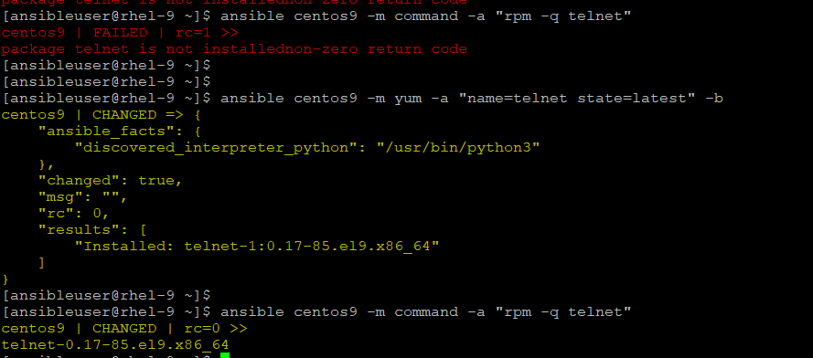
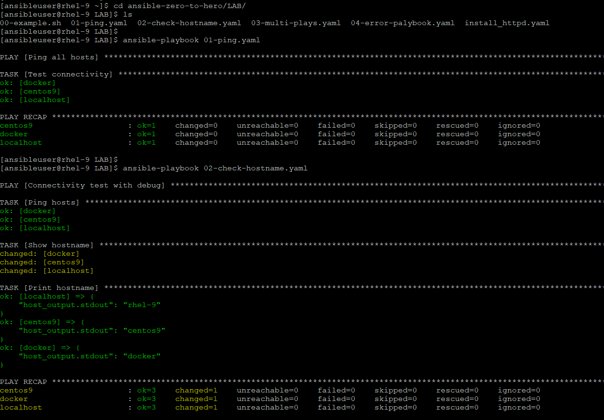
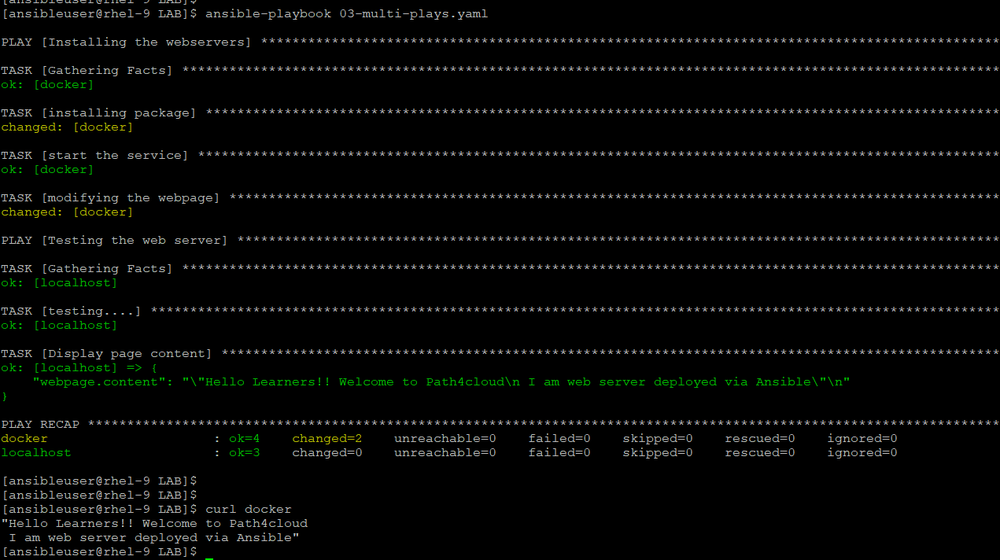

### A playbook in Ansible is a YAML file that defines what to do, where to do it, and how to do it.
- Think of it as a step-by-step automation script written in human-readable format.

🧩 Basic Playbook Structure
```
---                           ---> This indicates that starting of yaml file but comletely optional
- name: Playbook description  ---> Describes what the playbook does. Helps in readability and logs
  hosts: target_group         ---> Defines which machines to run on (from inventory)
  become: yes                 ---> Used for privilege escalation (like sudo for linux, RunAs for windows)

  vars:                       ---> Store reusable values
    variable_name: value      ---> name: value

  tasks:                      ---> List of actions executed in order. Each task uses a module
    - name: Task 1            ---> Name of tasks/description
      module_name:            ---> Module name like apt, yum
        key: value            ---> Module arguments in key:value format

  handlers:                   ---> Run only when triggered by notify, used for restarting services
    - name: Handler name      ---> Name of handler must match the task name where notify defined
      module_name:            ---> Module name like service
        key: value            ---> Module arguments in key:value format
```
- 🧠 Execution Flow (Important)
  - Ansible runs in this order -->
  - Read inventory
  - Load playbook
  - Execute tasks (top → bottom)
  - Trigger handlers (if notified)

## DEMO
- So far, we ran the adhoc command to get our task done.
  ```
  # ansible all -m ping
  centos9 | SUCCESS => {
    "ansible_facts": {
        "discovered_interpreter_python": "/usr/bin/python3"
    },
    "changed": false,
    "ping": "pong"
  }

  # ansible centos9 -m command -a uptime
    centos9 | CHANGED | rc=0 >>
    15:20:34 up  1:50,  1 user,  load average: 0.10, 0.04, 0.01

  # ansible docker -m command -a hostname
    docker | CHANGED | rc=0 >>
    docker
  ```
- We can multiple modules as adhoc like to install some package that also can be done:
  ```
  ansible centos9 -m yum -a "name=telnet state=latest" -b
  ```
  

- We can write these command as code in form of playbook and get our task done. We will refer the playbook from `LAB` section now.
  - [01-ping.yaml](../LAB/01-ping.yaml)
  - [02-check-hosttname.yaml](../LAB/02-check-hostname.yaml)

  ```
  We will run as "ansibleuser" and from LAB directory
  $ ansible-plabook -i <path_to_inventory> <playbook.yaml>

  But since we have set the inventory default path in our .ansible.cfg in user home directory and exported this as global. Verify with 
  $ ansible --version

  So, we can simply run:
  $ ansible-playbook <playbook.yaml>

  But IT IS HIGHLY RECOMMENDED, to check the syntax before we run any playbook.
  $ ansible-playbook <playbook.yaml> --syntax-check
  OR
  We can go to yamlint.com and paste the yaml file and check the syntax.And if all good, then we can run the playbook. BUT KEEP IN MIND, VALID YAML FILE DOESN'T MEAN IT'S A VALID PLAYBOOK.

  Ansible do have a check mode command, which is a dry run:
  $ ansible-playbook <playbook.yaml> -C
  ```
  

## ⚠️ Important Rules
- YAML is indentation-sensitive (very important ⚡)
- Use 2 spaces, not tabs
- Tasks run sequentially
- Idempotent (won’t repeat unnecessary changes)

## Multiplays playbook
- Yes, we can have multi plays playbook in one single playbook file, and it will be executed in sequence.
- Checout this [03-multi-plays.yaml](../LAB/03-multi-plays.yaml)

  