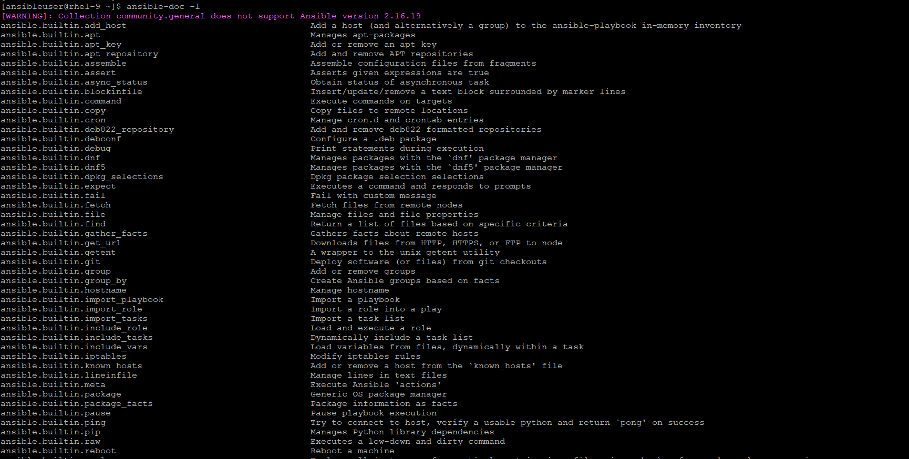
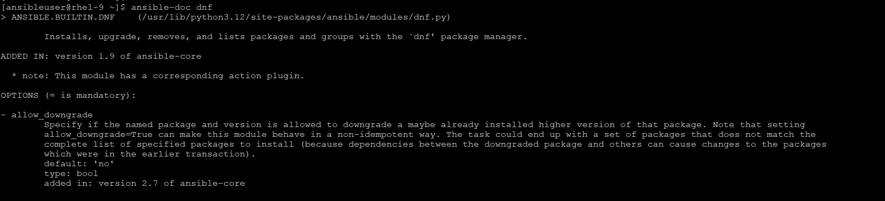
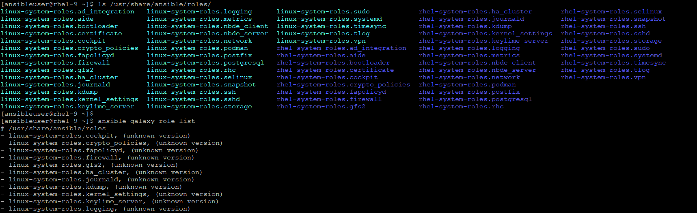
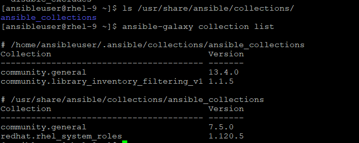
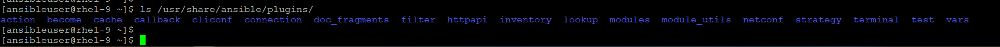
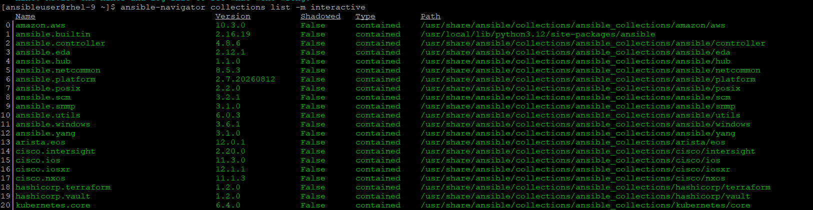
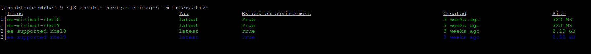
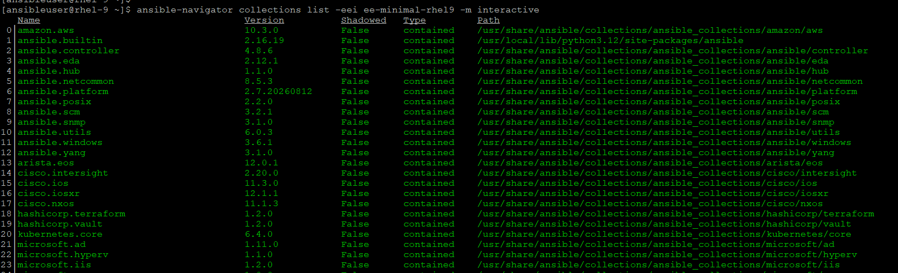

# Collections
Collections are a distributed format for Ansible content that can include playbooks, roles, modules and plugins. As modules move from the core Ansible repository into collections, the module documentations can be found [here](https://docs.ansible.com/projects/ansible/latest/collections/all_plugins.html).

We can install the collections through a distributed server, such as [Ansible Galaxy](https://galaxy.ansible.com/ui/) or [Pulp 3 Galaxy Server](https://pulpproject.org/pulp-operator/docs/admin/guides/configurations/galaxy/)

[check here](https://docs.ansible.com/projects/ansible/latest/dev_guide/developing_collections.html#developing-collections) to develop collections.

[check here](https://docs.ansible.com/projects/ansible/latest/galaxy/dev_guide.html) to develop roles via Galaxy Development Guide.

[check here](https://docs.ansible.com/projects/ansible/latest/community/contributions_collections.html) for Ansible Collections Contributor Guide.

[Indexes of all modules and plugins](https://docs.ansible.com/projects/ansible/latest/collections/all_plugins.html)

[Collection Index](https://docs.ansible.com/projects/ansible/latest/collections/index.html#list-of-collections)

## Local Modules, Roles and Collections
- List the modules

    $ ansible-doc -l

- List the description or documentation of a particular module

    $ ansible-doc <module_name>

- List the Roles

    $ ansible-galaxy role list
    (can be found at /usr/share/ansible/roles/ or ~/.ansible/roles)

- List the collections

    $ ansible-galaxy collection list
    (can be found at /usr/share/ansible/collections/ or ~/.ansible/collections/)

- List the plugins

    $ ls /usr/share/ansible/plugins/

## Execution Environment Collections
- We can check the loaded collection against the EE image

    $ ansible-navigator collections list -m interactive
    (will list the collection from default image, defined in ansible-navigator.yaml file)

- Check the collections list for a particular image

    $ ansible-navigator images -m interactive
    (chcek the available images)

    $ ansible-navigator collections list -eei ee-minimal-rhel9 -m interactive
    (will list the collections from a particular image)

- Later, we will discuss, how we can install a new collection in image and create a custom image as per our enviroment.
