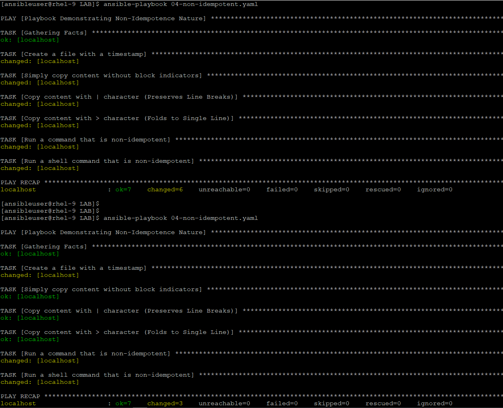
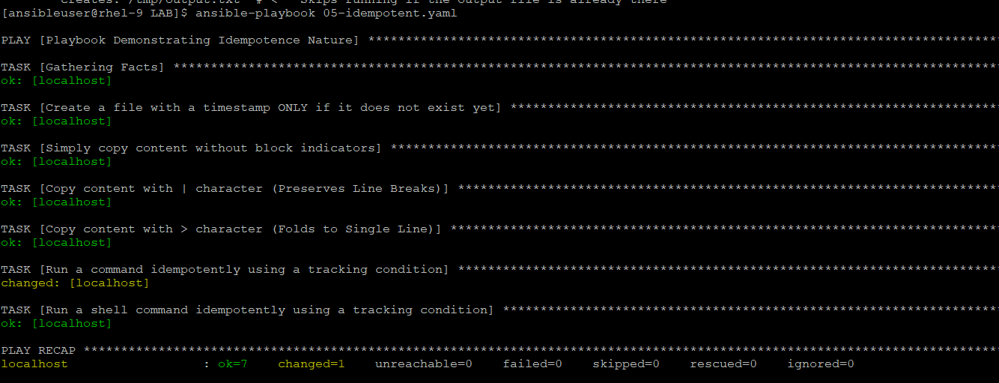
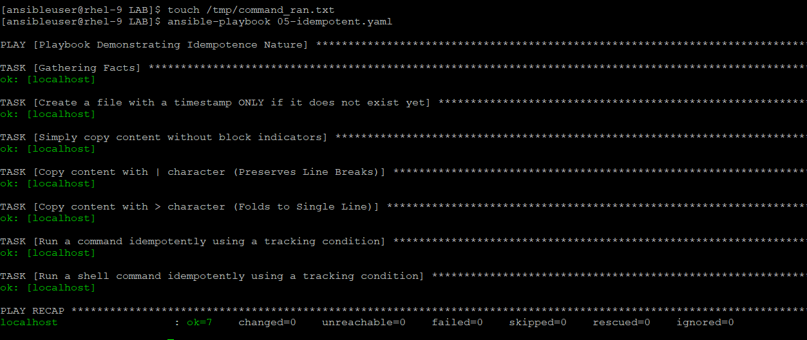

# Idempotent
- Idempotence means running a playbook 10 times results in the exact same system state as running it once, without making unnecessary modification.
- We have few NON-Idempotent modules:
    - **The Dynamic Content**: When Ansible sees "new content" every single run, forcing it to rewrite the file every time. for example, copy the synamic content result it to chnaged state everytime.
    - **The Naked command and shell Modules**: Ansible has no native way of tracking what generic command scripts do. Unless you explicitly tell it what to check for, it always assumes the state was modified and flags a yellow changed status.

## DEMO
1) Run this [04-non-idempotent.yaml](../LAB/04-non-idempotent.yaml)
    - We ran this playbook twice
    

    - With the first run, all tasks state resulted as changed.
    - But when we ran this next time, first task resutlted to change because of time (which changes everytime), and command & shell tasks chnaged again.

2) Now, we put the condition and explicitly telss to shell and command module when to run:
    ```
    - name: Run a command idempotently using a tracking condition
      command: echo "This command runs ONLY once because it creates a lockfile"
      args:
        creates: /tmp/command_ran.txt  # <-- Skips running if this file exists

    - name: Run a shell command idempotently using a tracking condition
      shell: echo "This shell command will run only once" > /tmp/output.txt
      args:
        creates: /tmp/output.txt  # <-- Skips running if the output file is already there
    ```

    - We ran the this [05-idempotent.yaml](../LAB/05-idempotent.yaml) twice:
        - in first run, command module executed because condition failed, no /tmp/command_ran.txt file exists.
        
        - In second run, we create the file and ran it, this time, no changed state reported.
        