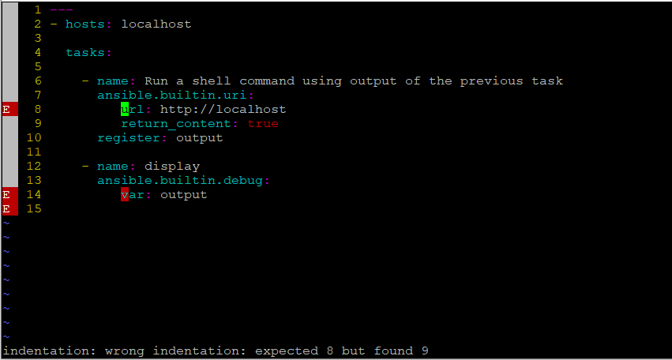
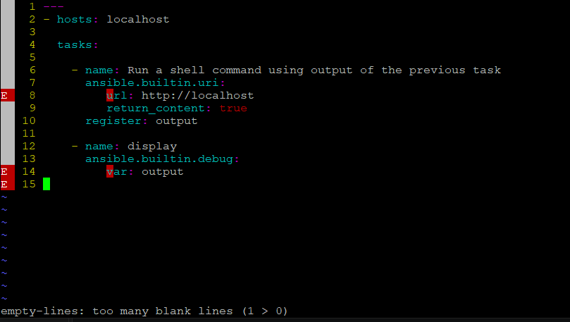
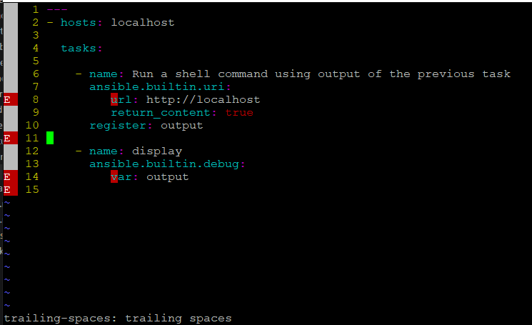

## BEST PRACTICES
- Playbook should be simple and descriptive, keep space in between of tasks and plays for better readability.
- Keep Consistency for variable or parameters values.
- Use Variables to keep the code dynamic and foller [Variable Precedence](https://docs.ansible.com/projects/ansible/latest/playbook_guide/playbooks_variables.html#understanding-variable-precedence).
- Use yaml tweaks to avoid syntax error.
- Use commandline alias to quickly run the playbook:
    - `alias anr="ansible-navigator run"`
    - `alias an="ansible-navigator"`
    - `alias ap="ansible-playbook"`
- Check the syntax of playbook before run or to upload to main sources:
    - `ansible-navigator run <playbook> --syntax-check`
- Keep the code(playbooks) at central distribution place like github.
- Organized your inventory as per your envrionment like, test, dev and prod.
- Use good editor or native yamllint which will highlight the indentation or extra empty line warning:
    - Recommended is `vscode` with extra extensions `Ansible` and `YAML` 
    - Make sure these 2 packages are installed if using `VIM`:
        - `vim-ale` (Asynchronous Lint Engine: This plugin runs in the background and scans your code as you type. It automatically triggers external syntax linters whenever you open specific file types.)
        - `yamllint` ( When you open a .yml or .yaml file, vim-ale finds yamllint on your Red Hat Enterprise Linux system. The default rule set for yamllint is very strict, it flags files that do not start with document markers (---), have incorrect spacing/indentation, or contain more than 0 blank lines at the absolute beginning of the file (which triggers the empty-lines: too many blank lines (1 > 0) error)).
            - If wrong indentation

             

            - If extra empty line

            

             - If any extra trailing space

            

            - If you want completely disable YAML linting in Vim:
                - create a file under user home directory:
                ```
                $ vim ~/.vimrc

                and put this content to tell ALE not to load linters for YAML files:
                let g:ale_linters = {'yaml': []}
                ```

            - If you want to keep the syntax checks active but ignore the annoying blank-line or indentation warnings, you can customize yamllint:
                - create a file under user home directory:
                ```
                $ vim ~/.yamllint

                and put this content to completely disable the blank lines and indentation rules:
                extends: default

                rules:
                    empty-lines: disable
                    indentation: disable
                    trailing-spaces: disable
                    document-start: disable
                    line-length: disable
                ```

        - Use `vim-ansible`, it is a Vim plugin designed to turn Vim into a powerful, syntax-aware development environment for writing Ansible playbooks, tasks, and templates. By default, Vim treats Ansible files as generic YAML (.yaml). While standard YAML highlighting displays keys and values, it doesn't understand Ansible-specific architecture. vim-ansible bridges that gap.