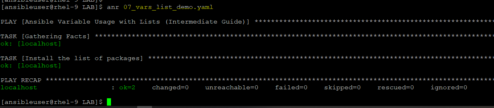
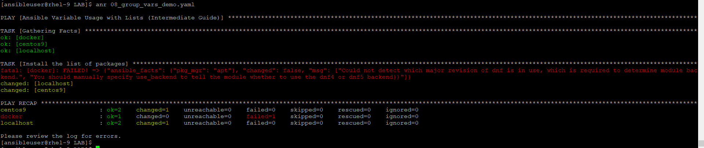
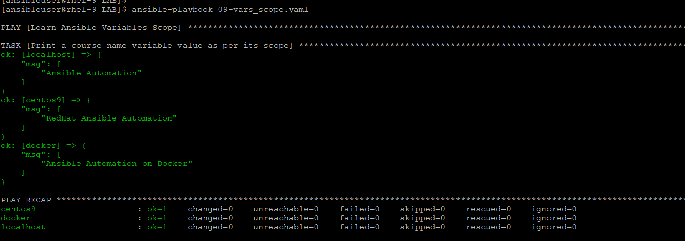

# Ansible Variables
- variables are used to store dynamic values (like usernames, package names, IP addresses, or file paths) so you can reuse your playbooks across different environments without hardcoding information.

- Rules
    - Must start with a letter or an underscore. It cannot start with a number.
    - Numbers are allowed in between or at the end
    - only `_` underscore are allowed in between
    - Forbidden: Dashes/hyphens (-), spaces, dots (.), or special characters ($, @, !)
    ```
    # ❌ INVALID NAMES:
    web-port: 80       # Contains a hyphen
    2nd_server: rhel   # Starts with a number
    web port: 80       # Contains a space

    #  VALID NAMES:
    web_port: 80
    server_2nd: rhel
    _backup_path: /opt/backup
    ```

- Ansible uses Jinja2 templating for variables. They must be wrapped in double curly braces: {{ variable_name }}.

- **When to quote variables**
    - If you start a value with {{ variable_name }}, you must quote the whole expression to create valid YAML syntax. If you do not quote the whole expression, the YAML parser cannot interpret the syntax. The parser cannot determine if it is a variable or the start of a YAML dictionary. 

- Refer [Official Documentation](https://docs.ansible.com/projects/ansible/latest/playbook_guide/playbooks_variables.html) for more details.

### Where to Define Variables (Scope)
- Ansible variables can be defined in multiple places depending on how wide you want their scope to be. They are grouped into three main categories:
    1. Playbook Level (Play or Task scope): You can define variables directly inside your playbook using the vars keyword:
    ```yaml
    ---
    - name: Variable Example Playbook
      hosts: all
      vars:
        web_package: httpd
        web_port: 80

      tasks:
        - name: Print the port
          ansible.builtin.debug:
            msg: "The web port is {{ web_port }}"
    ```

    2. Inventory / File Level (Best Practice): To keep playbooks clean, variables are usually separated into dedicated directories next to your inventory file:
        - group_vars/: Contains variables applied to a whole group of servers.
            - Example file: group_vars/webservers.yaml → web_port: 80
        - host_vars/: Contains variables unique to a specific single server.
            - Example file: host_vars/centos9.yaml → ansible_user: root

    3. Command Line (Extra Vars): You can override any variable at runtime using the --extra-vars (or -e) flag on the command line:
    ```
    $ ansible-playbook site.yml -e "web_port=8080 web_package=nginx"
    $ ansible-navigator run site.yml --eev web_port=8080
    ```
### Variable Precedence (Who Wins?)
- If you define a variable with the same name in multiple places, Ansible resolves the conflict using a strict hierarchy (from lowest to highest priority):
    - Inventory files (Lowest)
    - group_vars/
    - host_vars/
    - Playbook vars block
    - register variables from tasks
    - Extra vars (-e on CLI) (Highest - Always wins)

- There are more than 20 ways for ansible to decide which value will win the race. Check out [here](https://docs.ansible.com/projects/ansible/latest/playbook_guide/playbooks_variables.html#understanding-variable-precedence) for full list.

### Advanced Variable Features
- Registered Variables (register)
    - You can capture the output of a task into a temporary variable and use it in a later task:
    ```yaml
    - name: Check if a file exists
      ansible.builtin.stat:
        path: /etc/httpd/conf/httpd.conf
      register: httpd_conf_file

    - name: Print file status
      ansible.builtin.debug:
        msg: "File exists status is {{ httpd_conf_file.stat.exists }}"
    ```

- Ansible Facts
    - Whenever a playbook starts, it runs a hidden task called Gathering Facts. This retrieves real-time infrastructure data from the target machine (like network setups, OS type, and RAM details) and stores them in automatic variables:
        - {{ ansible_hostname }} → Returns host system name (e.g., rhel-9).
        - {{ ansible_os_family }} → Returns OS family (e.g., RedHat or Debian).

# DEMO
1. Variable at Play Level:
    - Run [07_vars_list_demo.yaml](../LAB/07_vars_list_demo.yaml), in this file, we have list of variables defined at play level and will be parse to taks within in same level.
    - We have few packages defined at play level, and we are targeting on localhost, since all are installed, so no changes are reported.

        $ ansible-navigator run 07_vars_list_demo.yaml

    

2. Variable at Group and Host Level:
    - We have two directories created at project directory, `group_vars` and `host_vars` where under `group_vars`, we have two files one is with name `all` which represents the all hosts in inventory file, and other is `linux` which represents the group of servers under `linux` group in inventory. And under `host_vars`, we have another two files with the same name of inventory host.
    - In these files, we have defined two variables, one is  `packages` and other is `course_name` with different values.
    - These variable values will be parsed as per their scope, for `all` under `group_vars` will be applicable to all but we have same variable defined for inventory host under `group_vars` and under for dedicated inventory host under `host_vars` so this value will be applied accordinly.
    - Let see in action:
        - At `group_vars` for all - `packages == telnet`
        - At `group_vars` for linux - `packages == git, curl and telnet`
        - At `host_vars` for centos9 - `pacakges == httpd`

        - Parsed values
            - `packages == telnet` will be applied to `docker and localhost` **(on docker, it will fail since dnf is not the package manager for ubuntu machine)**
            - `packages == httpd` will be applied to `centos9`, values defined at `group_vars` in `linux` will be overwritten by `host_vars`.

        - Current State
        ```
        [ansibleuser@rhel-9 LAB]$ rpm -q telnet
        package telnet is not installed

        [ansibleuser@centos9 ~]$ rpm -q telnet
        package telnet is not installed
        [ansibleuser@centos9 ~]$ rpm -q httpd
        package httpd is not installed
        ```

        - Run the playbook [08_group_vars_demo.yaml](../LAB/08_group_vars_demo.yaml):

                $ ansible-navigator 08_group_vars_demo.yaml

        

        - Post implementation state
        ```
        [ansibleuser@rhel-9 LAB]$ rpm -q telnet
        telnet-0.17-85.el9.x86_64

        [ansibleuser@centos9 ~]$ rpm -q telnet
        package telnet is not installed

        [ansibleuser@centos9 ~]$ rpm -q httpd
        httpd-2.4.62-15.el9.x86_64
        ```

3. Another play with variable scope, run with `ansible-playbook` command now:
    - for `all` value for `course_name` is `Ansible Automation`
    - for `linux` value for `course_name` is `RedHat Ansible Automation`
    - for `docker` value for `course_name` is `Ansible Automation on Docker`

    - Run this playbook [09-vars_scope.yaml](../LAB/09-vars_scope.yaml)

            $ ansible-playbook 09-vars_scope.yaml

    