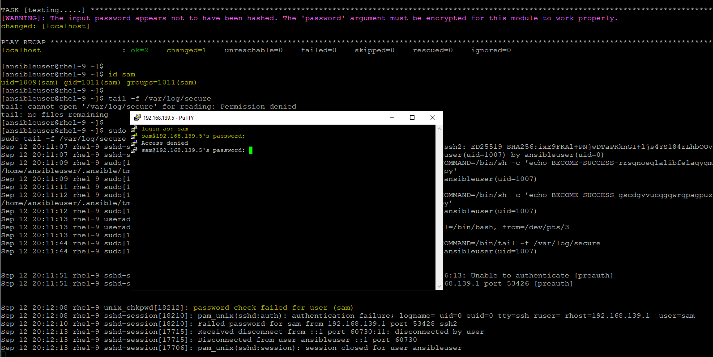
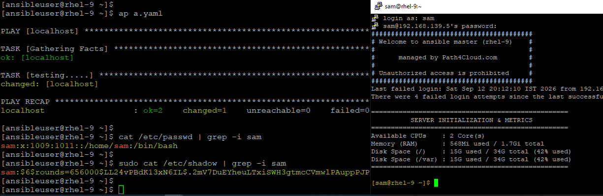

# Managing Secrets
- When dealing with Ansible secrets, your primary tool is Ansible Vault. It allows you to encrypt sensitive data—such as passwords, API keys, and private keys—directly inside your playbooks, variable files, or files themselves, rather than leaving them in plaintext.

- Let say, we need to add the username and password via ansible, so we can use `user` module to acheive the same.
    ```
    ansible.builtin.user:
        name: "{{ username }}"
        password: "{{ password }}"
        state: present
    ```
- This is technically correct but Linux systems cannot accept plaintext passwords via automated configuration managers like Ansible; they require the password string to already be obfuscated using a specific hashing algorithm (like SHA-512) along with a random string called a "salt".
- So, playbook will run but task will be completed partially with warning and user will be created and password will be stored in plain text in /etc/shadow file. So, we can't login with this user.
    ```
    $ cat /etc/passwd | grep -i sam
    sam:x:1009:1011::/home/sam:/bin/bash

    $ sudo cat /etc/shadow | grep -i sam
    sam:redhat:20708:0:99999:7:::
    ```

    

- So use this password_hash('sha512') which is a built-in Ansible filter that uses your control machine's underlying Python libraries to automatically generate a secure, salted SHA-512 hash string of your password.
    - For this filter to work correctly on your control machine, you must have the passlib Python library installed.
    ```
    check the Python version used by Ansible, if it is default version of your system wide, then use dnf install else, install the passlib using pip.

    $ ansible --version | grep "python version"
    python version = 3.12.14 (main, Aug 13 2026, 00:00:00) [GCC 11.5.0 20240719 (Red Hat 11.5.0-14)] (/usr/bin/python3.12)

    $ alternatives --config python3

    There are 3 programs which provide 'python3'.

    Selection    Command
    -----------------------------------------------
    +   1           /usr/bin/python3.9
        2           /usr/bin/python3.12
    *   3           /usr/bin/python3.13

    (here my system's global environment is configured via alternatives to use Python 3.13 as the default runtime and system's baseline python environment (Python 3.9) but my Ansible using 3.12 so I will force the installation inside the Python 3.12 library ecosystem using pip)

    $ /usr/bin/python3.12 -m pip install --user passlib
    Collecting passlib
    Obtaining dependency information for passlib from https://files.pythonhosted.org/packages/3b/a4/ab6b7589382ca3df236e03faa71deac88cae040af60c071a78d254a62172/passlib-1.7.4-py2.py3-none-any.whl.metadata
    Downloading passlib-1.7.4-py2.py3-none-any.whl.metadata (1.7 kB)
    Downloading passlib-1.7.4-py2.py3-none-any.whl (525 kB)
    ━━━━━━━━━━━━━━━━━━━━━━━━━━━━━━━━━━━━━━━━ 525.6/525.6 kB 1.2 MB/s eta 0:00:00
    Installing collected packages: passlib
    Successfully installed passlib-1.7.4

    If it says "/usr/bin/python3.12: No module named pip", then first install "python3.12-pip"
    $ sudo dnf install python3.12-pip -y

    If using dnf then run this:
    $ sudo dnf install python3-passlib
    ```
- Lets remove this user and this time, create with this filter.
    ```
    ansible.builtin.user:
      name: "{{ username }}"
      password: "{{ password | password_hash('sha512') }}"
      state: present
    ```

    - and this time, tasks completed succssfully, password is hashed and user is able to login.

    

- Demo
    - check this [17-password_filter.yaml](../LAB/17-password_filter.yaml)

#### In above example, password filter helps you to encrypt the password while creating the user but still it is not a good idea to keep the password at playbook level in clear text. So to avoid this kind of situation where we need to secure the passwords, api-keys, ssh-keys or other confidentails parameter,  we put or declare these variables in a dedicated variable files and to secure this we use `ANSIBLE VAULT`.

## Ansible Vault:
- It will encrypt the yaml files which has variables defined using AES256 based encryption.
- We can use `ansible-vault` command to:
    ```
    create              Create new vault encrypted file
    decrypt             Decrypt vault encrypted file
    edit                Edit vault encrypted file
    view                View vault encrypted file
    encrypt             Encrypt YAML file
    encrypt_string      Encrypt a string
    rekey               Re-key a vault encrypted file
    ```

- Demo:
    - Lets define the username and password in a separeate yaml file and encrypt that file using ansible-vault.
    - check this file [user_info.yaml](../LAB/user_info.yaml) where varaibles are defined now.
    - Run this playbook [18-password_vault.yaml](../LAB/18-password_vault.yaml) as below:
        ```
        $ ansible-vault encrypt user_info.yaml
        New Vault password:
        Confirm New Vault password:
        Encryption successful

        (it will prompt for password, set some password and remember that, that can be used to edit/view this file)

        $ cat user_info.yaml
        $ANSIBLE_VAULT;1.1;AES256
        62383466316462383336656530363537643862666431666635316364356663303664613937653934
        6433306430376139346431366635303666666334316533360a393165353963343265303434356138
        65643135633431363265366266376565323361623130626363303239383439633366346433323530
        3536666264393336320a633933633237653166626633306337373766343864656566383562646461
        38323432393033383263643934316461663931373463343861653730616164313330373831666537
        6530356238623036643935636532613336636534626133303332

        $ ansible-vault view user_info.yaml
        Vault password:
        ---
        username: sam
        password: redhat
        (pass the same password which we used while encrypting)
        ```

        ```
        $ ap 18-password_vault.yaml --vault-id @prompt
        $ ap 18-password_vault.yaml --ask-vault-pass
        OR
        $ anr 18-password_vault.yaml --vault-id @prompt
        $ anr 18-password_vault.yaml --ask-vault-pass

        (run any, it will prompt for password)
        NOTE: If we are using the new way, ansible-navigator then put this flag "--playbook-artifact-enable false" as well. Else, it will hang and stuck there. Since we are using this in out ansible-navigator.yaml file so we are good.
        ```
        - artifact disabled in `~/.ansible-navigator.yaml`
        ```
        execution-environment:
          image: registry.redhat.io/ansible-automation-platform-27/ee-supported-rhel9
        playbook-artifact:
          enable: false
        ```

    - In this example, we put the password in clear text as variable under vault but still if anyone knows the vault password, they can misuse this so to make it more secure, hashed the password adn then put the hash value inside the variable.
        ```
        $ ansible localhost -m debug -a "msg={{ 'redhat' | password_hash('sha512') }}"
        localhost | SUCCESS => {
            "msg": "$6$rounds=656000$M16.96GRkRn7dgVg$w4NgUwdd2jjSt/8k2fInf0K3nz2qR54WVz0VaKxRUUtXuhR/ODqulk75s52di0RsJm.7JvHWs3Ynmvb/z.Ot41"
        }

        (it will generate a new hash but this is for redhat only (in this demo), put this hash as value to passowrd variable, no need to define password_hash filter now)
        ```

    - We can store the vault password in a file to support our automated CI/CD or any other automation. (and make sure it is added to your .gitignore)
        - password is saved to this file [user_info_psd](../LAB/user_info_psd)

                $ echo redhat > user_info_psd
                $ chmod 0600 user_info_psd

                $ ap 18-password_vault.yaml --vault-password-file user_info_psd
                OR
                $ anr 18-password_vault.yaml --vault-password-file user_info_psd

        - If we don't want to pass this vault file path then we can define in `ansible.cfg` under `default` section. so, whenever a password is required then ansible knows from where it needs to fetch the password.
            ```
            [default]
            vault_password_file = <path>
            ```

    - More better way to organize the password containg file is defined as per predence of variables. Usually, we define under host_vars/<inventory_host>/file.yaml in same directory where we have playbook. This way, we don't need to define the variable in playbook.