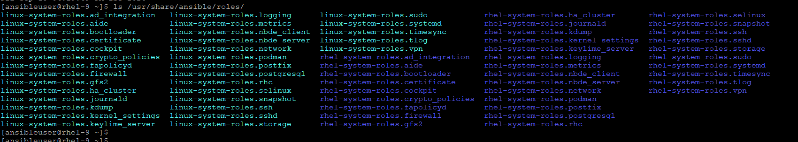

# Ansible Roles
- An Ansible Role is a framework that lets you bundle your playbooks, variables, tasks, handlers, and templates into a standardized directory structure. Instead of writing one massive playbook file, roles allow you to break your automation into modular, reusable components.
- Think of a role like a standalone app or a package that performs a specific function (e.g., install_nginx, setup_mysql, or configure_users).

## 📂 Standard Directory Structure of a Role
- When you create a role (usually by running `ansible-galaxy role init my_role_name`), Ansible generates a specific folder layout. Every folder is optional, but if it exists, Ansible looks for a main.yml file inside it automatically.
```
my_role/
├── defaults/      # Default variables for the role (lowest priority, easy to override)
│   └── main.yml
├── vars/          # High-priority variables specific to this role
│   └── main.yml
├── tasks/         # The main list of tasks to be executed by the role
│   └── main.yml
├── handlers/      # Handlers (e.g., service restarts) triggered by tasks
│   └── main.yml
├── templates/     # Jinja2 template files (.j2) that use variables
│   └── nginx.conf.j2
├── files/         # Static files to be copied to remote servers (no variables allowed)
│   └── banner.txt
├── meta/          # Metadata about the role (author, dependencies, platforms)
│   └── main.yml
└── README.md      # Documentation describing what the role does
```

## 🚀 How to Use Roles in a Playbook
- Once your role folder is created, you call it inside a standard master playbook. Ansible automatically knows where to find the tasks, handlers, and variables.
- There are three main ways to call a role in a playbook:

    1. Classic roles: statement (Static): Loaded before any other tasks in the play.
    ```yaml
    ---
    - name: Deploy Production Web Servers
      hosts: webservers
      become: true
      roles:
        - apache_webserver
    ```

    2. Dynamic include_role: Loaded at runtime when the execution hits this specific task block. Allows loops and conditional when statements.
    ```yaml
    ---
    - name: Deploy Environment
      hosts: webservers
      become: true
      tasks:
        - name: Set up Apache only if it is a production environment
          ansible.builtin.include_role:
            name: apache_webserver
          when: env == "production"
    ```

    3. Static import_rolePre-parsed at startup. Best if you need to use specific tags.
    ```yaml
    ---
    - name: Secure and Deploy
      hosts: webservers
      become: true
      tasks:
        - name: Import Apache Setup
          ansible.builtin.import_role:
            name: apache_webserver
          vars:
            http_port: 8080  # Overriding the default port 80 here
    ```

## Installing RHEL System Roles
- To install Red Hat Enterprise Linux (RHEL) System Roles, you must install the rhel-system-roles package. This package provides a collection of fully supported Ansible roles designed to automate common system administration tasks (like configuring network interfaces, firewalls, timesync, or storage).
- To install:
    ```
    $ sudo subscription-manager repos --enable=rhel-9-for-x86_64-appstream-rpms
    $ sudo dnf install rhel-system-roles
    $ ls /usr/share/ansible/roles/
    ```

    

## DEMO
- We will use the `rhel-system-roles.timesync` role in this demo.
- Every roles comes with `documentation` and `example playbooks`, you find at `/usr/share/doc/rhel-system-roles/`

```
$ ls /usr/share/doc/rhel-system-roles/
ad_integration  certificate  crypto_policies  gfs2        kdump            logging      nbde_server  postfix     selinux   sshd     systemd   vpn
aide            cockpit      fapolicyd        ha_cluster  kernel_settings  metrics      network      postgresql  snapshot  storage  timesync
bootloader      collection   firewall         journald    keylime_server   nbde_client  podman       rhc         ssh       sudo     tlog

$ ls /usr/share/doc/rhel-system-roles/timesync/
CHANGELOG.md  example-multiple-ntp-servers-playbook.yml  example-single-pool-playbook.yml  README.html  README.md
```

- Check the `/usr/share/doc/rhel-system-roles/timesync/README.md` [here](../LAB/timesync.md)

- We will target the `centos9` machine in our LAB to configure the `chrony` time setting using this role.
- Where we will pass the value for `ntp-servers` and `custom-settings` for log directory.
- It will take the backup of each file before it required to modify.
- Also, we are changing the `timezone` to verify the time in sync.
- check this playbook [68-rhel_role_timesync.yaml](../LAB/68-rhel_role_timesync.yaml)
    - with ansible-core run as: `$ ap 68-rhel_role_timesync.yaml`
    - with ansible-navigator as: `$ anr 68-rhel_role_timesync.yaml --ee false`
        - with `--ee false` completely bypasses the isolated execution environment container and forces Ansible to run directly on your physical RHEL 9 control node.