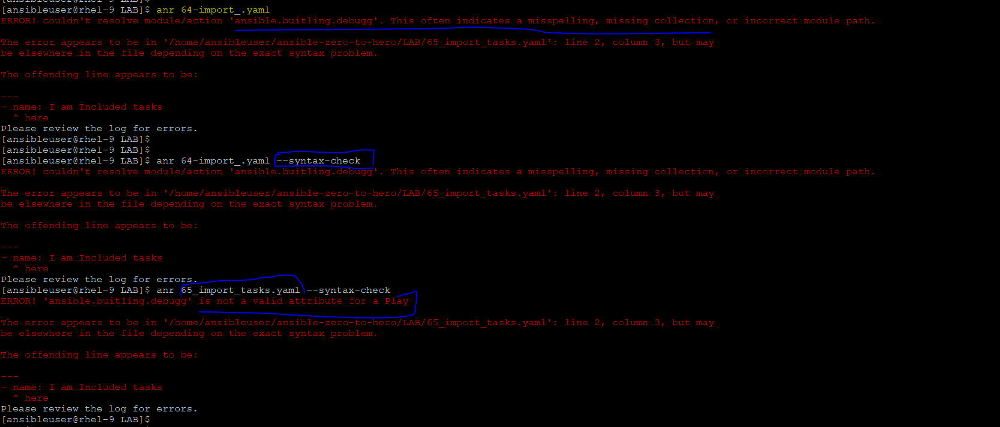

# Including or Importing Files
- In Ansible, splitting large playbooks into smaller, reusable files is a core best practice. You can reuse files using two distinct methodologies: Including (dynamic) and Importing (static).
- While they look similar on the surface, how and when they load tasks under the hood is completely different.

### The Core Difference (Static vs. Dynamic)
- `import_* (Static)`: Pre-processes files before the playbook starts running. It behaves like a literal copy-and-paste of the file contents right into your main playbook.
    - ansible.builtin.import_playbook : Import a playbook
    - ansible.builtin.import_role : Import a role into a play
    - ansible.builtin.import_tasks : Import a task list
- `include_* (Dynamic)`: Processes files on the fly exactly when execution reaches that specific task. It acts like an inline routing branch.
    - ansible.builtin.include_role : Load and execute a role
    - ansible.builtin.include_tasks : Dynamically include a task list
    - ansible.builtin.include_vars : Load variables from files, dynamically within a task

### DEMO `import_*`
- To verify the import_* process at the begining of the ansible playbook.
- Here, we have [64-import_.yaml](../LAB/64-import_.yaml) playbook which is importing the tasks from [65_import_tasks.yaml](../LAB/65_import_tasks.yaml) and while running or syntax-check for [64-import_.yaml](../LAB/64-import_.yaml), it is failing  in begining.
- Also, [65_import_tasks.yaml](../LAB/65_import_tasks.yaml) is not a playbook, rather it is a valid yaml file but not a `palybook`, notice the error while check syntax.

    

### DEMO `include_*`
- To verify the include_* processes only when the playbook reaches to that tasks.
- Here we have 